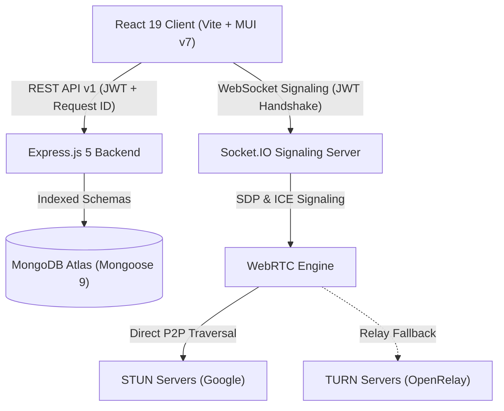
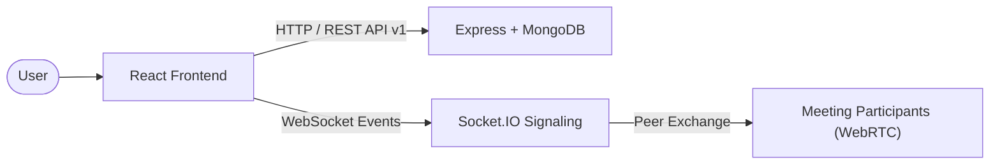
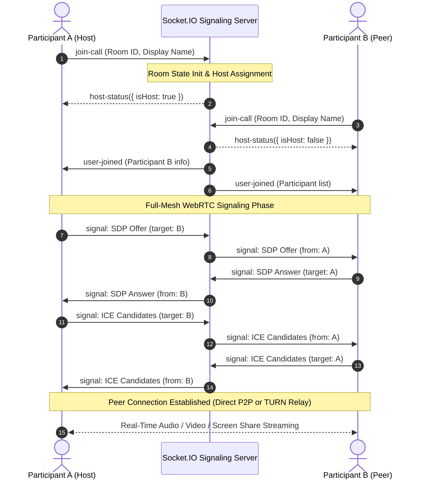

<div align="center">

# NovaCall

**Enterprise-Grade Real-Time Multi-Party Video Conferencing & Signaling Platform**

[](https://novacall-two.vercel.app/)
[](LICENSE)
[](https://react.dev/)
[](https://nodejs.org/)
[](https://expressjs.com/)
[](https://socket.io/)
[](https://webrtc.org/)
[](https://www.mongodb.com/)
[](docker-compose.yml)
[](e2e/)
[](http://localhost:8000/api/docs)

<br />

[Live Demo](https://novacall-two.vercel.app/) • [API Documentation](http://localhost:8000/api/docs) • [Socket Protocol Spec](backend/docs/SOCKET_EVENTS.md) • [Report Issue](https://github.com/Sekhar01807/Novacall/issues)

<br />


</div>

---

## Overview

NovaCall is an open-source real-time video conferencing platform built without commercial third-party WebRTC wrappers. It integrates a custom full-mesh WebRTC engine with a modular Socket.IO signaling layer, adaptive STUN/TURN NAT traversal, server-authoritative room moderation, stateless JWT authentication with instant revocation (`tokenVersion`), atomic IDOR-protected REST APIs, and request correlation tracking (`X-Request-Id`).

The platform includes a containerized Docker Compose environment, comprehensive unit and security test suites, and end-to-end browser testing with Playwright.

---

## Core Capabilities

### Video Conferencing & Adaptive NAT Traversal
- **Custom WebRTC Mesh Engine**: Multi-party audio/video streaming with dynamic peer connection pooling, track lifecycle management, and bandwidth optimization.
- **Adaptive NAT Traversal**: Dual Google STUN servers for direct P2P connections with automatic OpenRelay TURN fallback for restrictive symmetric NATs and enterprise firewalls.
- **In-Call Controls**: Camera and microphone toggles, native screen sharing via `getDisplayMedia`, and dynamic responsive video grids.
- **Connection Health Diagnostics**: Real-time round-trip time (RTT) tracking, jitter estimation, and live signal quality indicators.

### Server-Authoritative Room Moderation
- **Automatic Host Designation**: The initial participant entering a room is automatically assigned Host privileges.
- **Host Moderation Controls**: Remote participant microphone muting (`host-mute-user`), participant expulsion (`host-kick-user`), and global meeting termination (`end-meeting-all`).
- **Dynamic Host Succession**: Seamless promotion of the next longest-standing participant when the active host disconnects.
- **Mesh Capacity Enforcement**: Hard cap of 6 concurrent participants per room optimized for full-mesh P2P bandwidth.

### Real-Time Chat & Anti-Abuse
- **Low-Latency Message Delivery**: Broadcast via dedicated Socket.IO room channels with client-side optimistic UI updates.
- **Dual-Layer XSS Protection**: Server-side HTML entity sanitization (`sanitizeHTML`), 1000-character payload truncation, and contextual React JSX string encoding on the client.
- **Sliding-Window Rate Limiting**: Anti-flood protection (maximum 5 messages per 3-second window) per socket connection with automatic memory cleanup upon disconnection.
- **Chat History Synchronization**: Automatic synchronization of in-meeting chat history to newly joined participants.

### Zero-Trust Authentication & IDOR Protection
- **Stateless JWT Sessions**: HMAC-SHA256 access tokens verified across REST middleware and WebSocket handshakes.
- **Instant Session Revocation (`tokenVersion`)**: Atomic user `tokenVersion` increments immediately invalidate all active JWTs across devices upon password changes or global sign-out.
- **Safe Profile DTO Protection**: Explicit public DTO whitelisting (`buildUserProfileDTO`), strictly preventing leakage of reset tokens, expiration timestamps, token versions, or credentials.
- **Cryptographic Password Reset**: Secure 6-digit verification codes stored exclusively as SHA-256 hashes with 15-minute TTL, 5-attempt rate limits, and constant-time generic responses preventing account enumeration.
- **Strict Multi-Tenant Resource Isolation**: Atomic queries prevent unauthorized access or deletion of third-party meetings, histories, or profile data.
- **Standardized API Responses**: Centralized response formatting with structured error codes, correlation IDs (`X-Request-Id`, `X-Correlation-Id`), and API versioning (`X-API-Version`).

---

## Tech Stack

| Layer | Technologies | Purpose |
| :--- | :--- | :--- |
| **Frontend** | React 19, Vite, Material UI (MUI v7), Axios, WebRTC API | Single-Page Application (SPA), Design System & Real-Time Media Pipeline |
| **Backend** | Node.js 22 LTS, Express.js 5, Socket.IO 4.8 | RESTful API & Real-Time WebSocket Signaling Server |
| **Database** | MongoDB Atlas, Mongoose 9 | Multi-tenant schema storage with compound indexes |
| **Security** | jsonwebtoken, bcrypt, crypto (SHA-256), CORS, Hardened CSP | Zero-trust authentication, authorization, token revocation & rate limiting |
| **Infrastructure** | Docker, Docker Compose, Nginx, Vercel | Containerized multi-service orchestration and cloud edge hosting |
| **Testing** | Node.js Test Runner (`node:test`), Playwright E2E | Unit, security, socket lifecycle, and end-to-end browser test suites |

---

## System Architecture




> [!NOTE]
> For detailed Socket.IO event specifications, payload schemas, rate limit rules, and sequence diagrams, refer to the [Socket.IO Events Documentation](backend/docs/SOCKET_EVENTS.md).

### Communication Flow



---

## WebRTC Signaling & Connection Sequence

NovaCall coordinates direct peer-to-peer media streaming using an interactive ICE exchange pipeline:



---

## Project Structure

```
Novacall/
├── .github/
│   └── workflows/
│       └── ci.yml                 # Node 22 CI pipeline (npm ci, tests, build)
├── backend/
│   ├── src/
│   │   ├── controllers/          # REST route controllers
│   │   │   ├── user.controller.js          # Authentication (login, register)
│   │   │   ├── profile.controller.js       # Profile CRUD & session revocation
│   │   │   ├── passwordReset.controller.js # SHA-256 token generation & reset
│   │   │   ├── meetingHistory.controller.js# Activity pagination & scheduled meetings
│   │   │   └── socketManager.js            # Socket initialization wrapper
│   │   ├── docs/                 # OpenAPI 3.0 specification & Swagger UI
│   │   ├── middleware/           # auth.middleware.js, requestId.middleware.js
│   │   ├── models/               # UserModel.js, meetingModel.js, scheduledMeetingModel.js
│   │   ├── routes/               # UsersRoutes.js
│   │   ├── sockets/              # Modular Socket.IO architecture
│   │   │   ├── handlers/         # room, signaling, chat, media, moderation handlers
│   │   │   ├── middleware/       # Handshake JWT authentication & validator
│   │   │   ├── roomState.js      # In-memory room and message store
│   │   │   └── index.js          # Socket server initialization & routing
│   │   ├── utils/                # errorCodes.js, jwt.js, logger.js, validators.js
│   │   └── app.js                # Express app configuration, CSP, rate limiting & CORS
│   ├── tests/
│   │   ├── auth.test.js          # Auth, token tampering & revocation tests
│   │   ├── meetings.test.js      # Scheduled meetings & IDOR tests
│   │   ├── socket.test.js        # Socket lifecycle, room capacity & moderation tests
│   │   ├── chat.test.js          # Rate limiting, XSS sanitization & room isolation tests
│   │   └── webrtc.test.js        # WebRTC signaling boundary isolation tests
│   ├── Dockerfile                # Multi-stage Alpine container
│   ├── package.json
│   └── .env.example
├── frontend/
│   ├── src/
│   │   ├── contexts/             # AuthContext.jsx
│   │   ├── pages/                # Landing, Auth, Home, History, Profile, VideoMeet
│   │   │   └── videoMeet/        # Meeting orchestrator and components
│   │   │       ├── components/   # VideoGrid, VideoTile, ChatPanel, ParticipantList, etc.
│   │   │       ├── hooks/        # useWebRTCConnection.js, useMediaDevices.js
│   │   │       ├── services/     # socketService.js, meetingService.js
│   │   │       └── VideoMeet.jsx # Meeting view orchestrator
│   │   ├── styles/               # CSS modules & styling
│   │   ├── utils/                # withAuth.jsx
│   │   ├── App.jsx               # Application routing & providers
│   │   ├── index.css             # Design tokens & CSS variables
│   │   └── index.jsx
│   ├── Dockerfile                # Multi-stage Node 22 + Nginx SPA container
│   ├── nginx.conf                # Nginx SPA rewrite routing
│   ├── package.json
│   └── vite.config.js
├── e2e/
│   ├── flagship-flow.spec.js     # Full journey: Register → Login → Meet → Moderate → Leave
│   ├── auth.spec.js              # Authentication & onboarding tests
│   ├── lobby.spec.js             # Device readiness & lobby preview tests
│   ├── meeting.spec.js           # In-meeting controls and chat drawer tests
│   ├── webrtc-mesh.spec.js       # Multi-browser WebRTC peer discovery tests
│   ├── history.spec.js           # Meeting history & pagination tests
│   └── navigation.spec.js        # Route navigation & theme tests
├── screenshots/                  # Application interface captures
├── docker-compose.yml            # Multi-service stack (Frontend + Backend + MongoDB)
├── playwright.config.js          # Playwright E2E configuration
└── README.md                     # Project documentation
```

---

## Security Architecture & Authorization Invariants

NovaCall implements defense-in-depth security across HTTP REST and WebSocket signaling layers:

### 1. Invariable IDOR (Insecure Direct Object Reference) Protection
- **Scheduled Meetings**: Creation, retrieval, and deletion queries are strictly scoped to `req.user.username`. `DELETE /delete_scheduled_meeting/:id` executes an atomic `findOneAndDelete({ _id: id, user_id: req.user.username })` query. If the target resource belongs to another account, the server rejects the operation with `403 FORBIDDEN` (differentiated from `404 NOT_FOUND`).
- **Meeting Activity History**: History records and paginated query results are strictly bound to the authenticated `req.user.username`.
- **User Profile DTO Protection**: `GET /get_profile` and `POST /update_profile` return an explicit public DTO (`buildUserProfileDTO`), strictly preventing leakage of `resetPasswordToken`, `resetPasswordExpires`, `resetPasswordAttempts`, `tokenVersion`, or credentials.
- **Atomic Account Deletion**: Executes within a MongoDB transaction session to ensure clean cascading deletion of user history, scheduled meetings, and credentials.
- **Stateless Session Revocation (`tokenVersion`)**: Adding a `tokenVersion` counter to user records enables instantaneous revocation of all active JWT sessions whenever a user triggers `signOutAllDevices`, changes their password, or resets their credentials.
- **Anti-Enumeration Generic Responses**: Generic responses on `/login` (`AUTH_INVALID_CREDENTIALS`) and `/forgot_password` ensure malicious actors cannot enumerate registered usernames or emails.

### 2. Five-Stage Socket.IO Event Authorization Pipeline
Every real-time event passes through an authoritative 5-stage validation pipeline:

```
Handshake Authentication ──▶ Room Membership ──▶ Payload Validation ──▶ Authorization ──▶ State Transition
```

1. **Authentication**: Handshake JWT verification attaches verified user claims (`socket.user`). Client-supplied display names cannot spoof authenticated accounts.
2. **Room Membership**: Sockets must be active participants in the target room. Cross-room signaling and chat emissions are rejected.
3. **Payload Validation**: Input sizes, strings, and types are validated; signaling messages are capped at 64KB; chat messages are capped at 1000 characters.
4. **Authorization**: Host-exclusive actions (`host-mute-user`, `host-kick-user`, `end-meeting-all`) are verified server-side via `room.hostSocketId === socket.id`.
5. **State Transition**: State updates (media muting, participant eviction, room destruction) update `roomState` and notify room peers. Rate-limit tracking maps are automatically purged upon socket disconnect.

### 3. Password-Reset Production Boundary Case Study
- **Cryptographic Token Hashing**: Verification codes are generated via `crypto.randomInt(100000, 1000000)` and stored exclusively as a **SHA-256 hash** (`crypto.createHash("sha256")`).
- **TTL & Rate Limiting**: Reset codes expire strictly after **15 minutes** and enforce a maximum limit of **5 verification attempts** before irreversible invalidation. An unreferenced timer automatically purges expired in-memory records every 10 minutes.
- **Single-Use Invalidation**: The token is immediately destroyed upon successful password change and `tokenVersion` is incremented.
- **Production vs. Development Boundary**:
  - **Production (`NODE_ENV=production`)**: Verification codes are never exposed in API responses. In enterprise production, an external transactional mailer (e.g., Resend, AWS SES) delivers the code out-of-band to the user's verified inbox.
  - **Local Development / Testing**: When `NODE_ENV !== "production"` and no SMTP server is configured, the code is included in the mock response payload exclusively to facilitate automated integration and UI testing without external mail dependencies.

### 4. HTTP Headers, CSP & Rate Limiting Architecture
- **Security Headers & Hardened CSP**: Includes `X-Content-Type-Options: nosniff`, `X-Frame-Options: SAMEORIGIN`, `Referrer-Policy: strict-origin-when-cross-origin`, and a hardened `Content-Security-Policy` (`script-src 'self'`, `style-src 'self' 'unsafe-inline' https://fonts.googleapis.com`, `font-src 'self' https://fonts.gstatic.com data:`, `img-src 'self' data: blob:`, `media-src 'self' blob: mediastream:`, `connect-src 'self' ws: wss:`, `base-uri 'self'`, `object-src 'none'`).
- **Rate Limiting Architecture**: Both HTTP REST endpoints and Socket.IO signaling/moderation pipelines utilize high-throughput sliding-window in-memory stores. For horizontally scaled deployments, this model is designed to connect directly with a distributed Redis backend (via `rate-limit-redis` and `@socket.io/redis-adapter`).
- **Fail-Closed CORS**: Startup validation ensures production deployments refuse wildcard origins (`*`) when credentials are enabled.

---

## REST API Reference

| Endpoint | Method | Auth Required | Description |
| :--- | :---: | :---: | :--- |
| **Authentication & Password Recovery** | | | |
| `/api/v1/users/register` | `POST` | No | Register a new user account with email, username, and password |
| `/api/v1/users/login` | `POST` | No | Authenticate user and receive HMAC-SHA256 JWT access token |
| `/api/v1/users/forgot_password` | `POST` | No | Request 6-digit SHA-256 hashed password reset verification code |
| `/api/v1/users/reset_password` | `POST` | No | Verify reset code and update user password |
| **User Profile & Security** | | | |
| `/api/v1/users/get_profile` | `GET` | Yes | Retrieve authenticated user profile (safe DTO) |
| `/api/v1/users/update_profile` | `POST` | Yes | Update user preferences, status, and theme settings |
| `/api/v1/users/change_password` | `POST` | Yes | Change user password and invalidate existing sessions |
| `/api/v1/users/signout_all` | `POST` | Yes | Invalidate all active JWT tokens by incrementing `tokenVersion` |
| `/api/v1/users/delete_account` | `POST` | Yes | Permanently delete account and all associated meetings/history |
| **Meeting Management & History** | | | |
| `/api/v1/users/add_to_activity` | `POST` | Yes | Record a joined meeting code into user's activity log |
| `/api/v1/users/get_all_activity` | `GET` | Yes | Paginated meeting history with optional regex search query |
| `/api/v1/users/create_scheduled_meeting` | `POST` | Yes | Schedule an upcoming meeting with date, time, duration & zone |
| `/api/v1/users/get_upcoming_meetings` | `GET` | Yes | Fetch all scheduled meetings for the authenticated user |
| `/api/v1/users/delete_scheduled_meeting/:id` | `DELETE` | Yes | Atomic IDOR-protected cancellation of a scheduled meeting |
| **System & Monitoring** | | | |
| `/health` | `GET` | No | System health check (database connection status, uptime, timestamp) |
| `/api/docs` | `GET` | No | Interactive Swagger UI API explorer |
| `/api/openapi.json` | `GET` | No | OpenAPI 3.0 JSON specification |

---

## Automated Testing

NovaCall maintains a complete automated test matrix covering unit, security, socket lifecycle, and end-to-end browser flows:

```bash
# Run all backend unit, security, and socket tests
npm run test:backend

# Run complete Playwright end-to-end test suite
npm run test:e2e

# Run Playwright E2E tests with interactive UI mode
npm run test:e2e:ui
```

### Backend Test Matrix (`backend/tests/`)
- **Authentication (`auth.test.js`)**: Registration, duplicate rejection, login verification, expired JWT handling, tampered JWT detection, password reset SHA-256 hashing, rate limiting, `tokenVersion` revocation, safe profile DTO verification, and anti-enumeration generic responses.
- **Meetings & IDOR Invariants (`meetings.test.js`)**: Room code generation, scheduled meeting creation (`scheduled_date` & `scheduled_time`), pagination, atomic deletion, IDOR isolation across history, profile updates, and credential changes.
- **Socket.IO Lifecycle (`socket.test.js`)**: JWT handshake authentication, identity spoofing prevention, room join/leave lifecycle, host assignment, host succession upon disconnect, host mute/kick/end-meeting authorization, mesh capacity (6 users), and rate-limit map cleanup on disconnect.
- **Chat Anti-Abuse (`chat.test.js`)**: Sliding-window rate limiting (5 msg / 3s), XSS sanitization, 1000-character payload limits, and cross-room isolation.
- **WebRTC Signaling Boundary (`webrtc.test.js`)**: Intra-room SDP/ICE candidate relaying and cross-room signaling rejection.

### Playwright E2E Test Suite (`e2e/`)
- **Flagship Flow (`flagship-flow.spec.js`)**: End-to-end user journey: Register → Login → Create Room → Join Stage → Moderate Participants → Toggle Controls → Send Chat → Leave Cleanly.
- **Authentication Flow (`auth.spec.js`)**: User registration, login verification, validation states, and auth redirection.
- **Lobby & Pre-Call Preview (`lobby.spec.js`)**: Camera/mic device readiness, permission checks, and stage initialization.
- **In-Meeting Controls (`meeting.spec.js`)**: Device state toggling, participant drawer, chat interface, and exit confirmation dialogs.
- **WebRTC Mesh Discovery (`webrtc-mesh.spec.js`)**: Multi-browser peer discovery, stream attachment, and media state propagation.
- **Meeting History (`history.spec.js`)**: Activity log persistence, search filtering, and pagination.
- **Navigation & Layout (`navigation.spec.js`)**: Route navigation, guest access rules, and responsive interface layout.

---

## Getting Started

### Option 1: Docker Compose (Recommended)

Spin up the entire stack (Frontend, Backend, and MongoDB) with a single command:

```bash
docker compose up --build
```

- **Frontend SPA**: `http://localhost:3000`
- **Backend API**: `http://localhost:8000`
- **Interactive Swagger Docs**: `http://localhost:8000/api/docs`
- **Health Check Endpoint**: `http://localhost:8000/health`

---

### Option 2: Local Manual Setup

#### 1. Clone Repository
```bash
git clone https://github.com/Sekhar01807/Novacall.git
cd Novacall
```

#### 2. Backend Setup
```bash
cd backend
npm install
```

Create a `.env` file in the `backend/` directory:
```env
PORT=8000
ATLASDB_URL=your_mongodb_connection_string
JWT_SECRET=your_secure_jwt_secret
FRONTEND_URL=http://localhost:5173
```

Start the backend service:
```bash
npm run dev
```

#### 3. Frontend Setup
In a new terminal window:
```bash
cd frontend
npm install
```

Create a `.env` file in the `frontend/` directory:
```env
VITE_API_URL=http://localhost:8000
```

Start the frontend development server:
```bash
npm run dev
```

The application will be accessible at `http://localhost:5173`.

---

## API Documentation & Monitoring

NovaCall includes interactive Swagger UI documentation and health monitoring:

- **Interactive API Explorer**: [`http://localhost:8000/api/docs`](http://localhost:8000/api/docs)
- **OpenAPI 3.0 Specification**: [`http://localhost:8000/api/openapi.json`](http://localhost:8000/api/openapi.json)

### Health Check Endpoint

**`GET /health`**
```json
{
  "status": "ok",
  "uptime": 342,
  "database": "connected",
  "timestamp": "2026-08-24T08:00:00.000Z"
}
```

---

## Environment Variables

### Backend Configuration (`backend/.env`)

| Variable | Required | Default | Description |
| :--- | :---: | :---: | :--- |
| `PORT` | No | `8000` | HTTP and WebSocket server port |
| `ATLASDB_URL` | Yes | — | MongoDB Atlas connection string |
| `JWT_SECRET` | Yes | — | Secret key for HMAC-SHA256 JWT signing and verification |
| `FRONTEND_URL` | No | `http://localhost:5173` | Allowed CORS origins (comma-separated for multiple origins) |
| `MAX_ROOM_CAPACITY` | No | `6` | Maximum concurrent participants allowed per meeting room |
| `NODE_ENV` | No | `development` | Runtime environment (`development`, `production`, `test`) |
| `SMTP_HOST` | No | `smtp.gmail.com` | SMTP email server host for password reset dispatches |
| `SMTP_PORT` | No | `587` | SMTP server port (`587` for STARTTLS, `465` for SSL/TLS) |
| `SMTP_USER` | No | — | SMTP username / sender email address |
| `SMTP_PASS` | No | — | SMTP app password or secret key |
| `EMAIL_FROM` | No | `"NovaCall Security" <...>` | Sender display name and email address header |

### Frontend Configuration (`frontend/.env`)

| Variable | Required | Default | Description |
| :--- | :---: | :---: | :--- |
| `VITE_API_URL` | Yes | `http://localhost:8000` | Base URL for backend REST API and WebSocket connection |
| `VITE_TURN_URL` | No | — | Optional custom TURN relay server URL |
| `VITE_TURN_USERNAME` | No | — | Optional TURN server authentication username |
| `VITE_TURN_CREDENTIAL` | No | — | Optional TURN server authentication password/credential |

---

## Screenshots

| Landing Page | User Dashboard |
| :---: | :---: |
|  |  |
| **Video Meeting Stage** | **Chat & Participant Drawer** |
|  |  |
| **Meeting Activity History** | **User Profile & Settings** |
|  |  |

---

## Architecture Trade-offs & Deployment Scope

1. **Full-Mesh P2P Topology (6-Participant Capacity)**: Video and audio streams are exchanged directly peer-to-peer ($N-1$ streams per participant). The server enforces a hard limit of 6 participants per room to preserve client bandwidth and CPU usage. For larger rooms (20+ participants), transitioning to a Selective Forwarding Unit (SFU) architecture is recommended.
2. **Single-Instance In-Memory State**: Active meeting rooms, participant presence, and sliding-window rate limit counters are maintained in Node process memory for ultra-low latency signaling without database overhead. This single-node model is optimized for single-instance container deployments. For clustered horizontal scaling, state must be migrated to a shared Redis cluster (`@socket.io/redis-adapter` and Redis hash stores).
3. **Dual Authentication Boundary (HttpOnly Cookies + Bearer Tokens)**: The backend sets secure `HttpOnly` session cookies on authentication to mitigate XSS vector token theft while retaining Bearer header compatibility for decoupled cross-origin frontend hosting (e.g. Vercel + Render).
4. **Email Dispatching**: Password reset verification codes are dispatched via Nodemailer SMTP in production, with automatic development logger fallback during local testing.

---

## Roadmap

- [x] Modular Socket.IO architecture (signaling, room state, chat, media, and moderation handlers)
- [x] Modular REST controllers (`profile`, `passwordReset`, `meetingHistory`, `user`)
- [x] Hardened CSP headers, fail-closed CORS, and HttpOnly session cookies
- [x] IDOR protection and atomic resource ownership across all endpoints
- [x] Nodemailer SMTP email dispatch service with responsive HTML templates
- [x] Playwright E2E flagship workflow test suite
- [x] Centralized API error codes and request correlation IDs (`X-Request-Id`)
- [ ] SFU Media Gateway integration (mediasoup / Pion) for high-capacity rooms
- [ ] Distributed Redis Pub/Sub adapter for multi-instance horizontal scaling

---

## Author

**Sekhar Reddy**
- GitHub: [@Sekhar01807](https://github.com/Sekhar01807)
- LinkedIn: [Sekhar Reddy](https://www.linkedin.com/in/sekhar-reddy-408560281)

---

## License

This project is licensed under the [MIT License](LICENSE).
