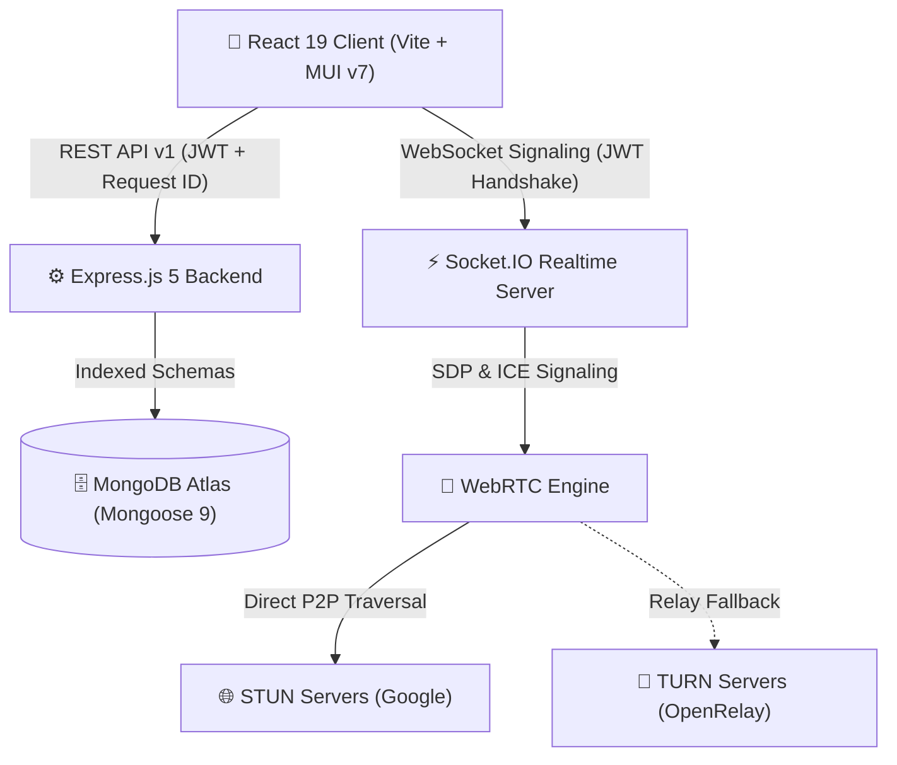
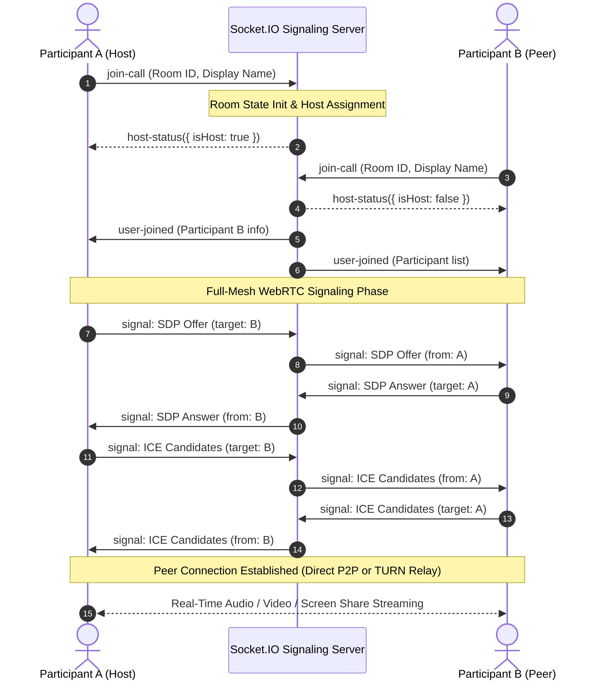

# NovaCall
### Real-Time Multi-Party Video Conferencing & Signaling Platform

[🚀 Live Demo](https://novacall-two.vercel.app/) · [💻 GitHub Repository](https://github.com/Sekhar01807/Novacall) · [📖 Swagger API Docs](http://localhost:8000/api/docs) · [⚡ Socket Protocol Guide](backend/docs/SOCKET_EVENTS.md)


**React 19** · **Node.js 22 LTS** · **Express.js 5** · **Socket.IO 4.8** · **WebRTC** · **MongoDB Atlas** · **Docker**

---

## 📖 The Engineering Story

NovaCall was engineered to explore the technical frontiers of real-time multi-party audio/video conferencing, bi-directional event signaling, and zero-trust session security.

Rather than relying on proprietary, closed third-party video SDKs, NovaCall implements a **custom full-mesh WebRTC engine** paired with a **modular Socket.IO signaling layer**. The architecture features automatic STUN/TURN NAT traversal, server-authoritative role security (host designation, remote mute, participant expulsion, and meeting termination), stateless JWT authentication with instant session revocation (`tokenVersion`), atomic IDOR-protected REST APIs, and correlation ID tracking (`X-Request-Id`). The platform is fully containerized with Docker and verified via an automated CI pipeline with end-to-end Playwright testing.

[](LICENSE)
[](https://reactjs.org/)
[](https://nodejs.org/)
[](https://www.mongodb.com/)
[](https://socket.io/)
[](docker-compose.yml)
[](.github/workflows/ci.yml)
[](http://localhost:8000/api/docs)
[](https://novacall-two.vercel.app/)

---

## ✨ Flagship Capabilities

### 🎥 High-Fidelity Video Conferencing & Adaptive NAT Traversal
- **Custom WebRTC Engine**: Multi-party audio/video streams with dynamic peer connection pooling, track lifecycle management, and bandwidth optimization.
- **Adaptive NAT Traversal**: Dual Google STUN servers for direct P2P connections with automatic OpenRelay TURN fallback for restrictive symmetric NATs and enterprise firewalls.
- **Real-Time Stage Controls**: Toggle microphone/camera, native screen sharing (`getDisplayMedia`), and dynamic responsive participant video grid.
- **Connection Health Monitor**: In-meeting round-trip time (RTT) calculation, jitter estimation, and live signal quality indicators.

### 👥 Server-Authoritative Meeting Moderation
- **Automatic Host Designation**: First participant to enter an active room is assigned authoritative Host privileges.
- **Host Moderation Tools**: Remote participant microphone muting (`host-mute-user`), participant expulsion (`host-kick-user`), and global meeting termination (`end-meeting-all`).
- **Dynamic Host Succession**: Automatic promotion of the next longest-standing participant when the current host leaves or disconnects.
- **Capacity Enforcement**: Hard cap of 6 concurrent participants per room optimized for full-mesh P2P bandwidth.

### 💬 Real-Time In-Meeting Chat & Anti-Abuse
- **Instant Message Broadcasting**: Socket.IO room channel distribution with client-side optimistic UI updates.
- **Dual-Layer XSS Protection**: Server-side HTML entity escaping (`sanitizeHTML`), hard 1000-character length truncation, and contextual React JSX string encoding on the frontend (no `dangerouslySetInnerHTML`).
- **Sliding-Window Rate Limiting**: Anti-flood protection (max 5 messages / 3-second sliding window) per socket connection with automatic memory cleanup on disconnect.
- **History Replay**: Automatic synchronization of prior in-meeting chat history to newly joined participants.

### 🔐 Zero-Trust Authentication & IDOR Protection
- **Stateless JWT Sessions**: HMAC-SHA256 access tokens verified across both REST middleware and Socket.IO handshakes.
- **Instant Session Revocation (`tokenVersion`)**: Atomic incrementing of user `tokenVersion` instantly invalidates all existing active tokens across all devices upon password reset or `signOutAllDevices`.
- **Safe Profile DTO Protection**: Whitelisted public profile DTO (`buildUserProfileDTO`), strictly preventing leakage of `resetPasswordToken`, `resetPasswordExpires`, `resetPasswordAttempts`, `tokenVersion`, or credentials.
- **Cryptographic Password Reset**: Verification codes are generated securely, stored exclusively as SHA-256 hashes with 15-minute TTL, max 5 verification attempts, and constant-time generic responses preventing username/email enumeration.
- **Strict IDOR Invariants**: Multi-tenant resource isolation ensuring users can never access, query, or delete another user's scheduled meetings, history, profile, or credentials.
- **Standardized Response Protocol & Request Correlation**: Centralized `formatSuccessResponse` / `formatErrorResponse` format with structured `ERROR_CODES`, correlation IDs (`X-Request-Id`, `X-Correlation-Id`), and API versioning (`X-API-Version`).

---

## 🛠️ Tech Stack

| Layer | Technologies | Purpose |
| :--- | :--- | :--- |
| **Frontend** | React 19, Vite, Material UI (MUI v7), Axios, WebRTC API | Single-Page Application (SPA), Design System & Real-Time Media Pipeline |
| **Backend** | Node.js 22 LTS, Express.js 5, Socket.IO 4.8 | RESTful API & Real-Time WebSocket Signaling Server |
| **Database** | MongoDB Atlas, Mongoose 9 | Multi-tenant schema storage with compound indexes |
| **Security** | jsonwebtoken, bcrypt, crypto (SHA-256), CORS, Hardened CSP | Zero-trust authentication, authorization, token revocation & rate limiting |
| **Infrastructure** | Docker, Docker Compose, Nginx, Vercel | Containerized multi-service orchestration and cloud edge hosting |
| **Testing** | Node.js Test Runner (`node:test`), Playwright E2E | Unit, security, socket lifecycle, and end-to-end browser test suites |

---

## 🏗️ Application Architecture




> 📖 **Real-Time Protocol Specification:** For a complete event dictionary, payload schemas, rate limit rules, and sequence diagrams, refer to [Socket.IO Events Documentation](backend/docs/SOCKET_EVENTS.md).

### Communication Flow


---

## 🌐 WebRTC Architecture (STUN + TURN Relay)

NovaCall establishes direct peer-to-peer media streaming using an interactive ICE exchange pipeline:



---

## 📁 Project Structure

```
Novacall/
├── .github/
│   └── workflows/
│       └── ci.yml                 # Node 22 CI pipeline (npm ci, tests, build)
├── backend/
│   ├── src/
│   │   ├── controllers/          # Modularized REST controllers
│   │   │   ├── user.controller.js          # Authentication (login, register) & root re-exports
│   │   │   ├── profile.controller.js       # Profile CRUD, safe DTO builder & session revocation
│   │   │   ├── passwordReset.controller.js # Cryptographic SHA-256 token generation & reset verification
│   │   │   ├── meetingHistory.controller.js# Activity pagination, schedule CRUD & atomic IDOR queries
│   │   │   └── socketManager.js            # Legacy socket bridge / initialization wrapper
│   │   ├── docs/                 # OpenAPI 3.0 specification & Swagger UI (swaggerSpec.js)
│   │   ├── middleware/           # auth.middleware.js, requestId.middleware.js
│   │   ├── models/               # UserModel.js, meetingModel.js, scheduledMeetingModel.js
│   │   ├── routes/               # UsersRoutes.js
│   │   ├── sockets/              # Modular Socket.IO architecture
│   │   │   ├── handlers/         # room.handler.js, signaling.handler.js, chat.handler.js, media.handler.js, moderation.handler.js
│   │   │   ├── middleware/       # socketAuth.middleware.js (Handshake JWT auth), socketValidator.js
│   │   │   ├── roomState.js      # In-memory room, host, participant, and message store
│   │   │   └── index.js          # Socket server initialization & modular routing
│   │   ├── utils/                # errorCodes.js, jwt.js, logger.js, roomCodeGenerator.js, validators.js
│   │   └── app.js                # Server entry point, hardened CSP, rate limiter & CORS
│   ├── tests/
│   │   ├── auth.test.js          # Authentication, token tampering, safe DTO & tokenVersion revocation tests
│   │   ├── meetings.test.js      # Scheduled meetings, compound indexes & atomic IDOR ownership tests
│   │   ├── socket.test.js        # Socket room lifecycle, auth, capacity cap & host moderation tests
│   │   ├── chat.test.js          # Chat rate limiting, XSS sanitization & room isolation tests
│   │   └── webrtc.test.js        # WebRTC signaling boundary isolation tests
│   ├── Dockerfile                # Node 22 Alpine production container
│   ├── package.json
│   └── .env.example
├── frontend/
│   ├── src/
│   │   ├── contexts/             # AuthContext.jsx
│   │   ├── pages/                # Landing, Auth, Home, History, Profile, 404, VideoMeet
│   │   │   └── videoMeet/        # Modularized meeting architecture
│   │   │       ├── components/   # LobbyView, MeetingControls, VideoGrid, VideoTile, ChatPanel, ParticipantList, ConnectionQualityIndicator, MeetingModals, MeetingHeader
│   │   │       ├── hooks/        # useWebRTCConnection.js, useMediaDevices.js
│   │   │       ├── services/     # socketService.js, meetingService.js
│   │   │       └── VideoMeet.jsx # Clean high-level orchestrator component
│   │   ├── styles/               # CSS modules & theme styling
│   │   ├── utils/                # withAuth.jsx
│   │   ├── App.css               # Clean professional light theme styling
│   │   ├── App.jsx               # Application routing & providers
│   │   ├── index.css             # Design tokens, typography & CSS variables
│   │   └── index.jsx
│   ├── Dockerfile                # Multi-stage Node 22 + Nginx SPA container
│   ├── nginx.conf                # Nginx SPA rewrite routing
│   ├── package.json
│   └── vite.config.js
├── e2e/
│   ├── flagship-flow.spec.js     # Flagship E2E: Register → Login → Create → Join → Moderation → Leave
│   ├── auth.spec.js              # Authentication & user onboarding spec
│   ├── lobby.spec.js             # Device readiness & lobby preview spec
│   ├── meeting.spec.js           # In-meeting controls, chat drawer, and leave flow spec
│   ├── webrtc-mesh.spec.js       # Multi-browser WebRTC peer discovery spec
│   ├── history.spec.js           # Meeting history & pagination spec
│   └── navigation.spec.js        # Navigation, guest access & theme switch spec
├── screenshots/                  # High-resolution application preview images
├── docker-compose.yml            # Multi-service stack (Frontend + Backend + MongoDB)
├── playwright.config.js          # Playwright E2E configuration
└── README.md                     # Comprehensive documentation & architecture guide
```

---

## 🔒 Security Architecture & Authorization Invariants

NovaCall enforces strict security boundaries across both HTTP and WebSocket interfaces:

### 1. Invariable IDOR (Insecure Direct Object Reference) Protection
- **Scheduled Meetings**: Creation, retrieval, and deletion queries are strictly scoped to `req.user.username`. `createScheduledMeeting` parses and persists schema-compliant `scheduled_date` (Date) and `scheduled_time`. `DELETE /delete_scheduled_meeting/:id` executes an atomic `findOneAndDelete({ _id: id, user_id: req.user.username })` query. If the resource exists under a different account, the server rejects the operation with `403 FORBIDDEN` (differentiated from `404 NOT_FOUND`).
- **Meeting Activity History**: History writes and paginated history queries are unconditionally bound to the authenticated `req.user.username`.
- **User Profile DTO Protection**: `GET /get_profile` and `POST /update_profile` return an explicit public DTO (`buildUserProfileDTO`), strictly preventing leakage of `resetPasswordToken`, `resetPasswordExpires`, `resetPasswordAttempts`, `tokenVersion`, or credentials.
- **Atomic Account Deletion**: Executes within a MongoDB transaction session with fallback to ensure clean cascading deletion of user history, scheduled meetings, and credentials.
- **Stateless Session Revocation (`tokenVersion`)**: Adding a `tokenVersion` counter to user records enables instantaneous revocation of all active JWT sessions whenever a user triggers `signOutAllDevices`, changes their password, or resets their credentials.
- **Anti-Enumeration Generic Responses**: Generic responses on `/login` (`AUTH_INVALID_CREDENTIALS`) and `/forgot_password` ensure malicious actors cannot enumerate registered usernames or emails.

### 2. Five-Stage Socket.IO Event Authorization Pipeline
Every real-time event must pass through an authoritative 5-stage validation gate:
$$\text{Handshake Authentication} \longrightarrow \text{Room Membership} \longrightarrow \text{Payload Validation} \longrightarrow \text{Authorization} \longrightarrow \text{State Transition}$$

1. **Authentication**: Handshake JWT verification attaches verified user claims (`socket.user`). Client-supplied display names cannot spoof authenticated accounts.
2. **Room Membership**: Sockets must be active participants in the target room. Cross-room signaling and chat emissions are rejected.
3. **Payload Validation**: Input sizes, strings, and types are validated; signaling messages are capped at 64KB; chat messages are capped at 1000 characters.
4. **Authorization**: Host-exclusive actions (`host-mute-user`, `host-kick-user`, `end-meeting-all`) are verified server-side via `room.hostSocketId === socket.id`.
5. **State Transition**: State updates (media muting, participant eviction, room destruction) update `roomState` and notify room peers. Rate-limit tracking maps are automatically purged upon socket disconnect.

### 3. Password-Reset Production Boundary Case Study
- **Cryptographic Token Hashing**: Verification codes are generated via `crypto.randomInt(100000, 1000000)` and stored exclusively as a **SHA-256 hash** (`crypto.createHash("sha256")`).
- **TTL & Rate Limiting**: Reset codes expire strictly after **15 minutes** and enforce a maximum limit of **5 verification attempts** before irreversible invalidation. An unreferenced timer automatically purges expired in-memory records every 10 minutes.
- **Single-Use Invalidation**: The token is immediately destroyed upon successful password change and `tokenVersion` is incremented.
- **Production vs. Development Boundary**:
  - **Production (`NODE_ENV=production`)**: Verification codes are **never** exposed in API responses. In enterprise production, an external transactional mailer (e.g., Resend, AWS SES) delivers the code out-of-band to the user's verified inbox.
  - **Local Development / Testing**: When `NODE_ENV !== "production"` and no SMTP server is configured, the code is included in the mock response payload exclusively to facilitate automated integration and UI testing without external mail dependencies.

### 4. HTTP Headers, CSP & Rate Limiting Architecture
- **Strict-Transport-Security & Hardened CSP**: Production security headers including `X-Content-Type-Options: nosniff`, `X-Frame-Options: SAMEORIGIN`, `Referrer-Policy: strict-origin-when-cross-origin`, and a tightened `Content-Security-Policy` (`script-src 'self'`, `style-src 'self' 'unsafe-inline' https://fonts.googleapis.com`, `font-src 'self' https://fonts.gstatic.com data:`, `img-src 'self' data: blob:`, `media-src 'self' blob: mediastream:`, `connect-src 'self' ws: wss:`, `base-uri 'self'`, `object-src 'none'`). Permissive directives and broad wildcards have been removed.
- **Rate Limiting Architecture**: Both HTTP REST endpoints and Socket.IO signaling/moderation pipelines utilize high-throughput sliding-window in-memory stores. This model is optimized for single-instance container deployments. For horizontally scaled multi-replica deployments, the architecture is designed to drop in a distributed Redis backend (via `rate-limit-redis` and `@socket.io/redis-adapter`).
- **Fail-Closed CORS**: Startup validation ensures production deployments refuse wildcard origins (`*`) when credentials are enabled.

---

## 📡 REST API Reference

| Endpoint | Method | Auth Required | Description |
| :--- | :---: | :---: | :--- |
| **Authentication & Password Recovery** | | | |
| `/api/v1/users/register` | `POST` | No | Register a new user account with email, username, and password |
| `/api/v1/users/login` | `POST` | No | Authenticate user and receive HMAC-SHA256 JWT access token |
| `/api/v1/users/forgot_password` | `POST` | No | Request 6-digit SHA-256 hashed password reset verification code |
| `/api/v1/users/reset_password` | `POST` | No | Verify reset code and update user password |
| **User Profile & Security** | | | |
| `/api/v1/users/get_profile` | `GET` | Yes | Retrieve authenticated user profile (safe DTO) |
| `/api/v1/users/update_profile` | `POST` | Yes | Update user preferences, status, and theme settings |
| `/api/v1/users/change_password` | `POST` | Yes | Change user password and invalidate existing sessions |
| `/api/v1/users/signout_all` | `POST` | Yes | Invalidate all active JWT tokens by incrementing `tokenVersion` |
| `/api/v1/users/delete_account` | `POST` | Yes | Permanently delete account and all associated meetings/history |
| **Meeting Management & History** | | | |
| `/api/v1/users/add_to_activity` | `POST` | Yes | Record a joined meeting code into user's activity log |
| `/api/v1/users/get_all_activity` | `GET` | Yes | Paginated meeting history with optional regex search query |
| `/api/v1/users/create_scheduled_meeting` | `POST` | Yes | Schedule an upcoming meeting with date, time, duration & zone |
| `/api/v1/users/get_upcoming_meetings` | `GET` | Yes | Fetch all scheduled meetings for the authenticated user |
| `/api/v1/users/delete_scheduled_meeting/:id` | `DELETE` | Yes | Atomic IDOR-protected cancellation of a scheduled meeting |
| **System & Monitoring** | | | |
| `/health` | `GET` | No | System health check (database connection status, uptime, timestamp) |
| `/api/docs` | `GET` | No | Interactive Swagger UI API explorer |
| `/api/openapi.json` | `GET` | No | OpenAPI 3.0 JSON specification |

---

## 🧪 Automated Testing Suites

NovaCall features comprehensive automated test suites spanning unit, security, socket, and end-to-end workflows:

```bash
# Run all backend unit, security, and socket tests
npm run test:backend

# Run complete Playwright end-to-end test suite
npm run test:e2e

# Run Playwright E2E tests with interactive UI mode
npm run test:e2e:ui
```

### 1. Backend Security & Authorization Test Matrix (`backend/tests/`)
- ✅ **Authentication (`auth.test.js`)**: Signup, duplicate handling, login, wrong password rejection, expired JWT handling, tampered JWT detection, password reset SHA-256 hashing, rate limiting, **token version session revocation**, **safe profile DTO verification (no reset token leakage)**, and **anti-enumeration generic responses**.
- ✅ **Meetings & IDOR Invariants (`meetings.test.js`)**: Room code generation, scheduled meeting creation (`scheduled_date` & `scheduled_time`), listing, atomic deletion, IDOR isolation across history, profile updates, and password changes.
- ✅ **Socket.IO Real-Time Lifecycle (`socket.test.js`)**: JWT handshake authentication, identity spoofing prevention, room join/leave, host assignment, host succession upon disconnect, host mute/kick/end-meeting authorization, mesh capacity (6 users), and **rate-limit map cleanup on disconnect**.
- ✅ **Chat Anti-Abuse (`chat.test.js`)**: Sliding-window rate limiting (5 msg/3s), XSS sanitization, 1000-character payload limits, and room isolation.
- ✅ **WebRTC Signaling Boundary (`webrtc.test.js`)**: Intra-room SDP/ICE candidate relaying and cross-room signaling rejection.

### 2. High-Value Flagship Playwright E2E Flow (`e2e/flagship-flow.spec.js`)
Tests the complete end-to-end user journey across the live application:
1. **Register**: Creates a new user account with RFC-compliant email and password.
2. **Login**: Authenticates credentials and verifies redirect to `/home` (Dashboard).
3. **Create Meeting**: Initializes a new conference room from the dashboard.
4. **Join**: Transitions from lobby into active meeting stage with video grid and Host badge.
5. **Moderation & In-Meeting Controls**: Opens participant drawer, validates host controls, toggles mic/cam states, and verifies in-meeting chat delivery.
6. **Leave**: Triggers the leave confirmation dialog, cleanly tears down media streams, and returns to Dashboard.

---

## ⚙️ Getting Started

### 🐳 Option 1: Run with Docker Compose (Recommended)
Spin up the entire stack (Frontend, Backend, and MongoDB) with a single command:

```bash
docker compose up --build
```
- **Frontend SPA**: `http://localhost:3000`
- **Backend API**: `http://localhost:8000`
- **Interactive Swagger Docs**: `http://localhost:8000/api/docs`
- **Health Check Endpoint**: `http://localhost:8000/health`

---

### 💻 Option 2: Local Manual Setup

#### 1. Clone Repository
```bash
git clone https://github.com/Sekhar01807/Novacall.git
cd Novacall
```

#### 2. Backend Setup
```bash
cd backend
npm install
```

Create a `.env` file in `backend/`:
```env
PORT=8000
ATLASDB_URL=your_mongodb_connection_string
JWT_SECRET=your_secure_jwt_secret
FRONTEND_URL=http://localhost:5173
```

Start the backend:
```bash
npm run dev
```

#### 3. Frontend Setup
Open another terminal:
```bash
cd frontend
npm install
```

Create a `.env` file in `frontend/`:
```env
VITE_API_URL=http://localhost:8000
```

Start the frontend:
```bash
npm run dev
```

Open `http://localhost:5173` in your browser.

---

## 📚 API Documentation (OpenAPI / Swagger)

NovaCall includes interactive Swagger UI documentation directly on the backend server:

- **Interactive API Explorer**: [`http://localhost:8000/api/docs`](http://localhost:8000/api/docs)
- **Raw OpenAPI 3.0 JSON**: [`http://localhost:8000/api/openapi.json`](http://localhost:8000/api/openapi.json)

---

## 🩺 Monitoring & Health Check

The backend exposes a health endpoint for automated container orchestration, load balancers, and uptime monitors:

**`GET /health`**
```json
{
  "status": "ok",
  "uptime": 342,
  "database": "connected",
  "timestamp": "2026-08-19T12:00:00.000Z"
}
```

---

## 🔑 Environment Variables

### Backend
| Variable | Description |
| :--- | :--- |
| `PORT` | Backend server port (default: `8000`) |
| `ATLASDB_URL` | MongoDB Atlas connection string |
| `JWT_SECRET` | Secret key used for HMAC-SHA256 JWT signing & verification |
| `FRONTEND_URL` | Allowed CORS origin(s) (e.g. `https://novacall-two.vercel.app,http://localhost:5173`) |
| `MAX_ROOM_CAPACITY` | Maximum participants per room (default: `6`) |
| `NODE_ENV` | Environment mode (`development` \| `production` \| `test`) |

### Frontend
| Variable | Description |
| :--- | :--- |
| `VITE_API_URL` | Backend API URL (e.g. `http://localhost:8000` or production URL) |
| `VITE_TURN_URL` | *(Optional)* Custom TURN relay server URL |
| `VITE_TURN_USERNAME` | *(Optional)* TURN server username |
| `VITE_TURN_CREDENTIAL` | *(Optional)* TURN server credential |

---

## 📸 Screenshots Gallery

| 1. Landing Page | 2. User Dashboard |
| :---: | :---: |
|  |  |
| **3. Video Meeting Room** | **4. Chat & Participant Drawer** |
|  |  |
| **5. Meeting Activity History** | **6. User Profile & Settings** |
|  |  |

---

## 🚧 Current Limitations & Engineering Trade-offs

1. **P2P Mesh Topology (Enforced Capacity = 6)**: Video and audio streams are exchanged directly peer-to-peer. A server-enforced **6-participant capacity limit** keeps client uplink bandwidth within standard broadband capacity ($N-1$ streams). For 20+ participant rooms, transitioning to a Selective Forwarding Unit (SFU) like mediasoup/Pion is recommended.
2. **In-Memory Active Room State & Single-Instance Lifecycle**: Active meeting room presence, participant metadata, and sliding-window rate limit counters reside entirely within the Node.js process memory (`roomState.js` `Map`). While this achieves sub-millisecond signaling latency without database round-trips, it represents a single-instance architecture: a server restart mid-meeting drops ephemeral room presence (requiring participants to re-join/reconnect), and horizontal multi-instance scaling requires migrating state to a shared Redis cluster (`@socket.io/redis-adapter` and Redis hash stores).
3. **Password Reset Production Boundary**: In local/testing mode, verification codes are included in responses to facilitate automated test runners; in production, codes are dispatched via external SMTP.

---

## 🔮 Production Roadmap

- [x] **Modular Socket.IO Architecture**: Refactored signaling, room state, chat, media, and moderation handlers.
- [x] **Modular REST & Meeting Architecture**: Decomposed controllers (`profile`, `passwordReset`, `meetingHistory`, `user`) and streamlined `VideoMeet` orchestration hooks (`useWebRTCConnection`, `LobbyView`, `MeetingModals`).
- [x] **Hardened Security & Tightened CSP**: Removal of permissive script `unsafe-inline` and wildcard `connect-src` directives; documented single-instance in-memory rate limiting.
- [x] **IDOR-Protected Resource Layer**: Atomic query ownership verification across all user data endpoints.
- [x] **Flagship Playwright E2E Suite**: End-to-end lifecycle verification from user registration to meeting moderation.
- [x] **Standardized Error Handling & Response Contracts**: Centralized `formatSuccessResponse` / `formatErrorResponse`, structured `ERROR_CODES`, and request correlation IDs (`X-Request-Id`).
- [ ] **SFU Media Gateway**: Transitioning to mediasoup / Pion for large enterprise conference routing.
- [ ] **Distributed Redis Pub/Sub**: Integrating `@socket.io/redis-adapter` for multi-instance cluster deployments.
- [ ] **Live SMTP Mailer**: Integrating Resend / AWS SES with cryptographically signed magic links.

---

## 👨‍💻 Author

**Sekhar Reddy**
- GitHub: [@Sekhar01807](https://github.com/Sekhar01807)
- LinkedIn: [Sekhar Reddy](https://www.linkedin.com/in/sekhar-reddy-408560281)

---

## 📄 License

This project is open source and available under the [MIT License](LICENSE).
