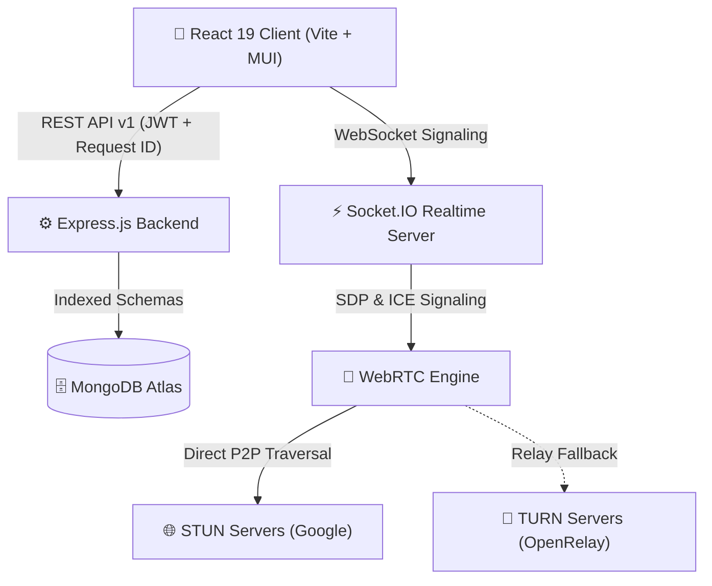
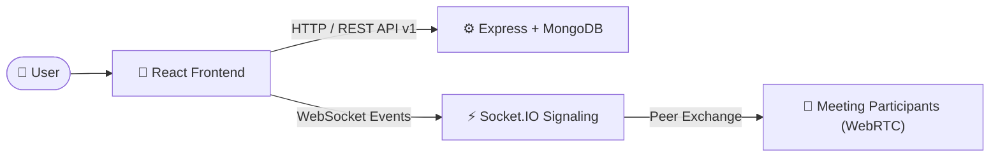
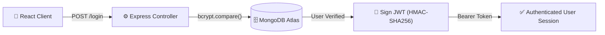
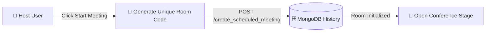
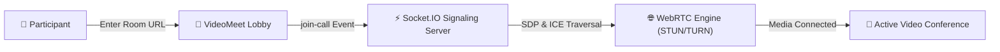
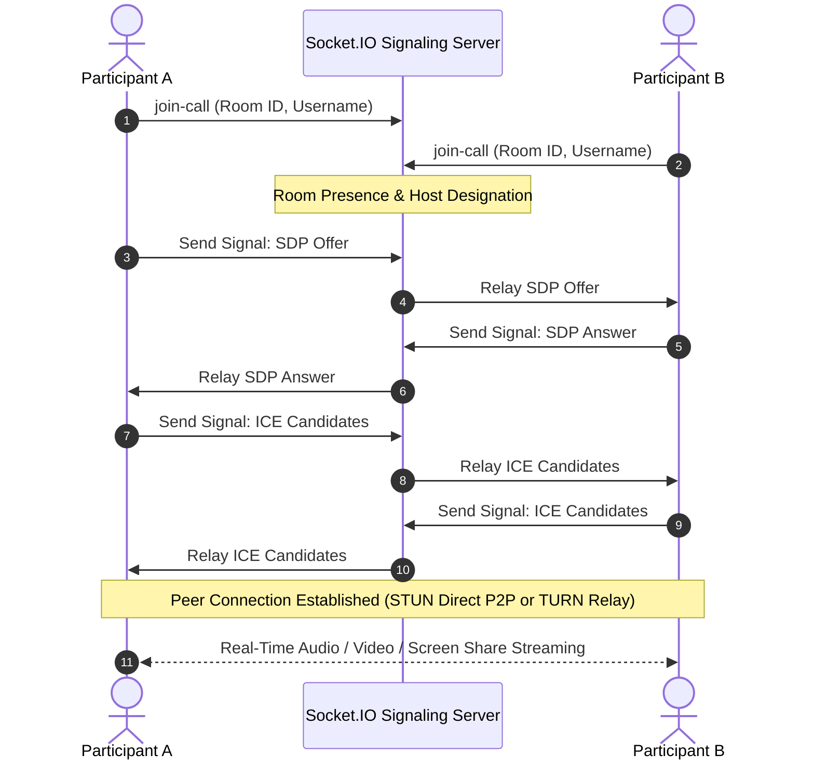
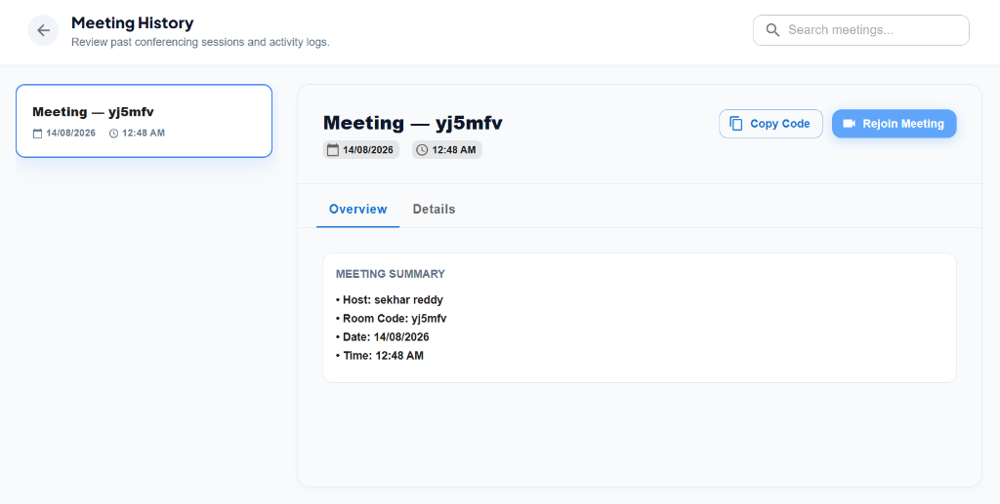

# NovaCall

A production-style full-stack real-time video conferencing application built with **Node.js 22 LTS, Express, React 19, WebSockets (Socket.IO), WebRTC (STUN + TURN Relay), MongoDB, and Vercel**.

[](LICENSE)
[](https://reactjs.org/)
[](https://nodejs.org/)
[](https://www.mongodb.com/)
[](https://socket.io/)
[](docker-compose.yml)
[](.github/workflows/ci.yml)
[](http://localhost:8000/api/docs)
[](https://novacall-two.vercel.app/)

NovaCall is a web-based video conferencing application that enables users to create and join meeting rooms, communicate through real-time audio/video, share their screen, exchange messages, and manage participants during a meeting.

The project was built to explore real-time communication, WebRTC-based media streaming, Socket.IO signaling, REST APIs, authentication, and persistent data management.

---

## 🚀 Live Demo

**Application:** [NovaCall (Live Deployment)](https://novacall-two.vercel.app/)

> *The application is deployed for demonstration purposes. Some functionality may depend on browser permissions and WebRTC network conditions.*

---

## ✨ Features

### 🔐 Authentication
- User registration and login
- JWT-based authentication
- Password hashing with bcrypt
- Protected user operations & route middleware
- User profile management
- Password change functionality

### 🎥 Video Conferencing
- Create and join meeting rooms
- Real-time audio and video communication
- Camera and microphone controls
- Screen sharing
- Participant video grid
- Join/leave meeting handling
- Meeting connection status

### 💬 Real-Time Communication
- Real-time meeting chat
- Room-based Socket.IO communication
- Instant message broadcasting
- Participant presence updates

### 👥 Meeting Management
- Host and participant roles
- Host participant controls (Mute participants, Remove participants, End meeting for all)
- Participant list drawer

### 📅 Meeting Scheduling
- Schedule future meetings
- View upcoming meetings
- Delete scheduled meetings
- Meeting information management

### 📊 Meeting History
- View previous meetings
- Store meeting activity
- Track meeting participation and history

### 👤 User Profile
- View profile information
- Update profile
- Manage account information

---

## 🛠️ Tech Stack

### Frontend
- **React 19**
- **Vite**
- **JavaScript (ES6+)**
- **Material UI (MUI v7)**
- **Axios**
- **WebRTC API**
- **Socket.IO Client**

### Backend
- **Node.js 22 LTS**
- **Express.js**
- **Socket.IO**
- **MongoDB** & **Mongoose 9**
- **jsonwebtoken (Standard JWT)**
- **bcrypt**

### Deployment & Infrastructure
- **Vercel** — Production Frontend SPA Hosting
- **Node.js Container Runtime / Render** — Production Backend API & WebSocket Server
- **MongoDB Atlas** — Managed Cloud Database
- **Docker & Docker Compose** — Local & Production Containerization
- **GitHub Actions** — Automated Continuous Integration (CI) Pipeline

---

## 🏗️ Application Architecture




> 📖 **Real-Time Protocol Specification:** For a complete event dictionary, payload schemas, rate limit rules, and sequence diagrams, refer to [Socket.IO Events Documentation](backend/docs/SOCKET_EVENTS.md).

### Communication Flow


---

## 🔄 How a Meeting Works

### 1. User Authentication Flow


### 2. Meeting Creation Flow


### 3. Joining & WebRTC Connection Flow


### 4. Real-Time Communication
Socket.IO is used for signaling and real-time application events (participant presence, chat messages, host moderation, and media states). WebRTC handles the actual audio/video media transmission directly peer-to-peer with automatic TURN relay fallback.

---

## 🌐 WebRTC Architecture (STUN + TURN Relay)

NovaCall uses WebRTC for high-performance audio/video communication with multi-server ICE traversal:



### Protocols & Mechanisms Involved:
- `RTCPeerConnection` for direct media streaming
- `MediaStream` (`getUserMedia` & `getDisplayMedia`)
- **STUN for NAT Discovery** (`stun.l.google.com:19302`): Resolves public IP/port candidates for direct peer-to-peer connectivity
- **TURN as Relay Fallback** (`openrelay.metered.ca` / custom TURN): Relays media streams when direct peer-to-peer connectivity fails due to restrictive firewalls or symmetric NATs
- **Socket.IO Signaling**: Exchanges session descriptions (SDP offers/answers) and candidate descriptors

---

## 📁 Project Structure

```
Novacall/
├── .github/
│   └── workflows/
│       └── ci.yml                 # Node 22 CI pipeline (npm ci, tests, build)
├── backend/
│   ├── src/
│   │   ├── controllers/          # user.controller.js, socketManager.js (re-exporter)
│   │   ├── docs/                 # OpenAPI 3.0 specification & Swagger UI
│   │   ├── middleware/           # auth.middleware.js (Bearer token verification)
│   │   ├── models/               # UserModel.js, meetingModel.js, scheduledMeetingModel.js
│   │   ├── routes/               # UsersRoutes.js
│   │   ├── sockets/              # Modular Socket.IO architecture
│   │   │   ├── middleware/       # socketAuth.middleware.js (Handshake JWT auth)
│   │   │   ├── handlers/         # room.handler.js, signaling.handler.js, chat.handler.js, media.handler.js, moderation.handler.js
│   │   │   ├── roomState.js      # In-memory room, host, participant, and message store
│   │   │   └── index.js          # Socket initialization & event routing
│   │   ├── utils/                # jwt.js, logger.js
│   │   └── app.js                # Server entry point & graceful shutdown
│   ├── tests/
│   │   ├── api.test.js           # REST API, JWT, security, & validation tests
│   │   └── socket.test.js        # Socket.IO room lifecycle, host moderation, & disconnect tests
│   ├── .dockerignore
│   ├── .env.example
│   ├── .gitignore
│   ├── Dockerfile                # Node 22 Alpine production container
│   ├── package-lock.json
│   └── package.json
├── frontend/
│   ├── public/                   # Static assets & favicons
│   ├── src/
│   │   ├── assets/               # Images & icons
│   │   ├── contexts/             # AuthContext.jsx
│   │   ├── pages/                # Landing, Auth, Home, History, Profile, 404, VideoMeet
│   │   │   └── videoMeet/        # Modular components, hooks, and services
│   │   ├── styles/               # CSS modules & themes
│   │   ├── utils/                # withAuth.jsx
│   │   ├── App.jsx               # App routing
│   │   ├── index.css
│   │   └── index.jsx
│   ├── .dockerignore
│   ├── .gitignore
│   ├── Dockerfile                # Multi-stage Node 22 + Nginx SPA container
│   ├── eslint.config.js
│   ├── index.html
│   ├── nginx.conf                # Nginx SPA rewrite routing
│   ├── package-lock.json
│   ├── package.json
│   ├── vercel.json               # Vercel SPA routing
│   └── vite.config.js
├── screenshots/                  # 6 live high-res preview images
├── .gitignore                    # Full protection for secrets, logs, and artifacts
├── docker-compose.yml            # Multi-service stack (Frontend + Backend + MongoDB)
└── README.md                     # Comprehensive documentation & architecture guides
```

---

## ⚙️ Getting Started

### Prerequisites
Make sure you have installed:
- **Node.js 22 LTS**
- **npm** (v9+)
- **MongoDB** (Local instance or MongoDB Atlas URI)
- **Git**

Check versions:
```bash
node --version
npm --version
git --version
```

### 🐳 Option 1: Run with Docker Compose (Recommended)
You can spin up the entire stack (Frontend, Backend, and MongoDB) with a single command:

```bash
docker compose up --build
```
- **Frontend App**: `http://localhost:3000`
- **Backend API**: `http://localhost:8000`
- **Interactive Swagger Docs**: `http://localhost:8000/api/docs`
- **Health Check Endpoint**: `http://localhost:8000/health`

---

### 💻 Option 2: Local Manual Setup

#### 1. Clone the Repository
```bash
git clone https://github.com/Sekhar01807/Novacall.git
cd Novacall
```

#### 2. Backend Setup
```bash
cd backend
npm install
```

Create a `.env` file in `backend/`:
```env
PORT=8000
ATLASDB_URL=your_mongodb_connection_string
JWT_SECRET=your_secure_jwt_secret
FRONTEND_URL=http://localhost:5173
```

Start the backend:
```bash
npm run dev
```

#### 3. Frontend Setup
Open another terminal:
```bash
cd frontend
npm install
```

Create a `.env` file in `frontend/`:
```env
VITE_API_URL=http://localhost:8000
```

Start the frontend:
```bash
npm run dev
```

Open `http://localhost:5173` in your browser.

---

## 📚 API Documentation (OpenAPI / Swagger)

NovaCall includes interactive Swagger UI documentation directly on the backend server:

- **Interactive API Explorer**: [`http://localhost:8000/api/docs`](http://localhost:8000/api/docs)
- **Raw OpenAPI 3.0 JSON**: [`http://localhost:8000/api/openapi.json`](http://localhost:8000/api/openapi.json)

---

## 🩺 Monitoring & Health Check

The backend exposes a health endpoint for automated container orchestration, load balancers, and uptime monitors:

**`GET /health`**
```json
{
  "status": "ok",
  "uptime": 342,
  "database": "connected",
  "timestamp": "2026-08-14T01:40:00.000Z"
}
```

---

## 🔑 Environment Variables

### Backend
| Variable | Description |
| :--- | :--- |
| `PORT` | Backend server port (e.g. `8000`) |
| `ATLASDB_URL` | MongoDB Atlas connection string |
| `JWT_SECRET` | Secret key used for HMAC-SHA256 JWT signing & verification |
| `FRONTEND_URL` | Allowed CORS origin(s) (e.g. `https://novacall-two.vercel.app,http://localhost:5173`) |

### Frontend
| Variable | Description |
| :--- | :--- |
| `VITE_API_URL` | Backend API URL (e.g. `http://localhost:8000` or production URL) |
| `VITE_TURN_URL` | *(Optional)* Custom TURN relay server URL |
| `VITE_TURN_USERNAME` | *(Optional)* TURN server username |
| `VITE_TURN_CREDENTIAL` | *(Optional)* TURN server credential |

---

## 🔒 Security & Reliability Architecture

NovaCall implements robust engineering and security standards:
- **Stateless JWT Authentication**: Passwords hashed with bcrypt; access tokens signed with HMAC-SHA256 and verified through Express middleware (`req.user` binding).
- **Strict CORS Origin Filtering**: Dynamic allowed origin configuration across both REST API endpoints and Socket.IO handshakes.
- **WebRTC STUN + TURN Relay**: Direct peer-to-peer WebRTC connections with automatic fallback to TURN relay servers for restrictive corporate firewalls and symmetric NATs.
- **Graceful Process Termination**: Catches `SIGTERM` and `SIGINT` to safely drain HTTP requests, disconnect Socket.IO peers, and close database connections cleanly.
- **Automated CI Pipeline**: GitHub Actions workflow (`.github/workflows/ci.yml`) validates backend syntax, runs automated unit & security tests, and verifies frontend builds on every push.

---

## 🧪 Automated Testing Suite

Run the full backend automated test suite (powered by Node.js built-in `node:test` runner):

```bash
cd backend
npm test
```

### 1. REST API, Security & Validation Tests (`tests/api.test.js`)
- ✅ JWT access token signing & signature verification
- ✅ Tampered token detection & signature rejection
- ✅ Expired token invalidation
- ✅ Password complexity and RFC-compliant email regex validation
- ✅ In-meeting chat XSS HTML sanitization
- ✅ OpenAPI 3.0 documentation completeness and route parity
- ✅ Structured logger credential masking & secret redaction
- ✅ Password reset limitation response payload structure

### 2. Socket.IO Real-Time Architecture & Authorization Tests (`tests/socket.test.js`)
- ✅ **Socket Authentication**: JWT token verification on handshake and structured guest fallback
- ✅ **Identity Spoof Prevention**: Server-enforces genuine display names from JWT claims
- ✅ **Room Lifecycle**: Room creation, participant tracking, host status assignment, and duplicate join resolution
- ✅ **Signaling Boundary Isolation**: Intra-room WebRTC SDP/ICE routing permitted; cross-room signals blocked
- ✅ **Server-Side Host Authorization**: Host mute, kick, and end-meeting controls strictly enforced; non-host actions rejected
- ✅ **Disconnection & Host Succession**: Automatic host promotion on disconnect and complete memory teardown when empty

---

## 📸 Screenshots

### 1. Landing Page


### 2. User Dashboard & Meeting Scheduler


### 3. Video Meeting Room


### 4. Real-Time In-Meeting Chat & Participant Drawer


### 5. Meeting Activity History


### 6. User Profile & Settings


---

## 🧠 Key Engineering Concepts

NovaCall was built to understand and apply several important full-stack concepts:
- **Modular Socket Architecture**: Decomposed real-time handlers (`auth`, `roomState`, `room`, `signaling`, `chat`, `media`, `moderation`).
- **Client-server architecture**: Clean separation of React frontend and Node.js REST / WebSocket backend.
- **REST API design**: Structured HTTP endpoints with status codes, validation, and Bearer token auth middleware.
- **JWT authentication**: Stateless token verification with Express middleware and Socket.IO handshake interception.
- **Password hashing**: Secure password storage using bcrypt with salt rounds.
- **MongoDB data modeling**: Mongoose schemas and relationships for users, history, and scheduled meetings.
- **Real-time communication**: Event-driven WebSocket communication via Socket.IO with server-side authorization.
- **WebRTC peer connections**: Interactive video, audio, and screen sharing across browser endpoints with STUN/TURN traversal.
- **React component architecture**: Modular component hierarchy, custom hooks, and context state management.

---

## 🚧 Current Limitations & Engineering Trade-offs

To provide full engineering transparency, NovaCall's current architectural trade-offs are documented below:

### 1. P2P Mesh Topology (Enforced Capacity = 6)
- **Current Behavior**: Video and audio streams are exchanged directly peer-to-peer between client browsers in a full-mesh topology. The server strictly enforces a **6-participant capacity limit** (`MAX_ROOM_CAPACITY=6`) per room.
- **Rationale**: Full-mesh topology provides zero media server bandwidth costs and ultra-low latency for 2–6 participants. For enterprise-scale meetings (20+ participants), an upstream Selective Forwarding Unit (SFU) like mediasoup/Pion is recommended to reduce client uplink load from $O(N)$ to $O(1)$.

### 2. In-Memory Active Room State & Event Rate Limiting
- **Current Behavior**: Active meeting rooms, participant maps, host status, and event rate-limiting records (chat, signaling, moderation) reside in the signaling server's memory.
- **Rationale**: Zero external latency and optimal performance for single-instance signaling. For multi-node horizontal scaling behind a load balancer, a shared Redis adapter (`@socket.io/redis-adapter`) and sticky sessions are recommended.

### 3. Password Reset Security & Simulated Email Delivery
- **Current Behavior**: The password reset workflow generates secure 6-digit verification codes, stores them using **SHA-256 cryptographic hashing**, enforces a **15-minute expiration window**, caps verification attempts at **5 attempts max**, and invalidates the code on single use.
- **Production Safety**: When running in production mode (`NODE_ENV=production`), verification codes are never exposed in API responses. In local development/testing mode, the code is included for automated UI and integration testing.

---

## 🔮 Production Roadmap
- **SFU Media Gateway**: Transitioning to mediasoup / Pion for server-side video routing in large conference rooms.
- **Redis Distributed Pub/Sub**: Integrating `@socket.io/redis-adapter` for multi-instance cluster deployments.
- **Live SMTP / Transactional Mailer**: Integrating Resend / AWS SES with cryptographically signed time-limited reset links.
- **Headless E2E Multi-Peer Tests**: Multi-browser WebRTC integration testing with Playwright.

---

## 🎯 Project Goals

The main goal of NovaCall was to gain practical experience building a real-time full-stack application and understand how different technologies work together:
**React + Node.js / Express + MongoDB + Socket.IO + WebRTC + JWT Authentication**

---

## 👨‍💻 Author

**Sekhar Reddy**
- GitHub: [@Sekhar01807](https://github.com/Sekhar01807)
- LinkedIn: [Sekhar Reddy](https://www.linkedin.com/in/sekhar-reddy-408560281)

---

## 📄 License

This project is open source and available under the [MIT License](LICENSE).
