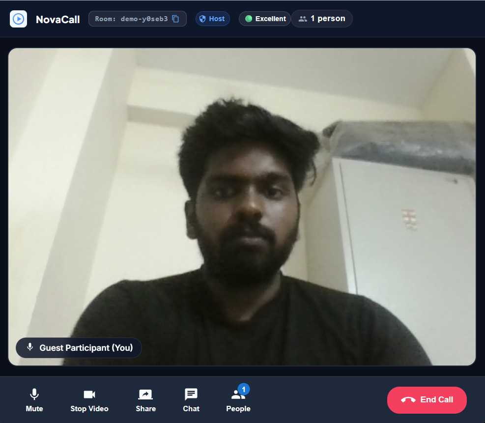
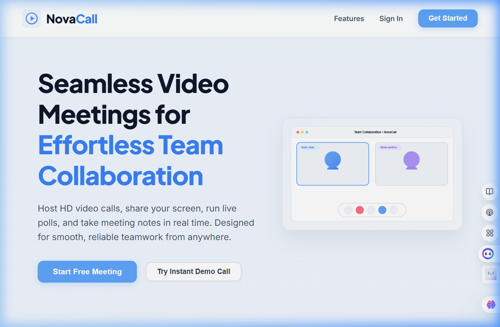
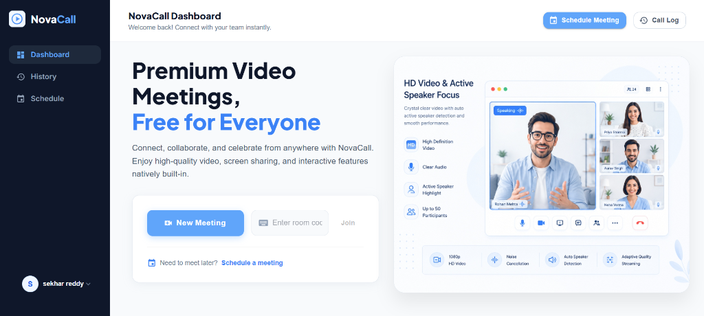
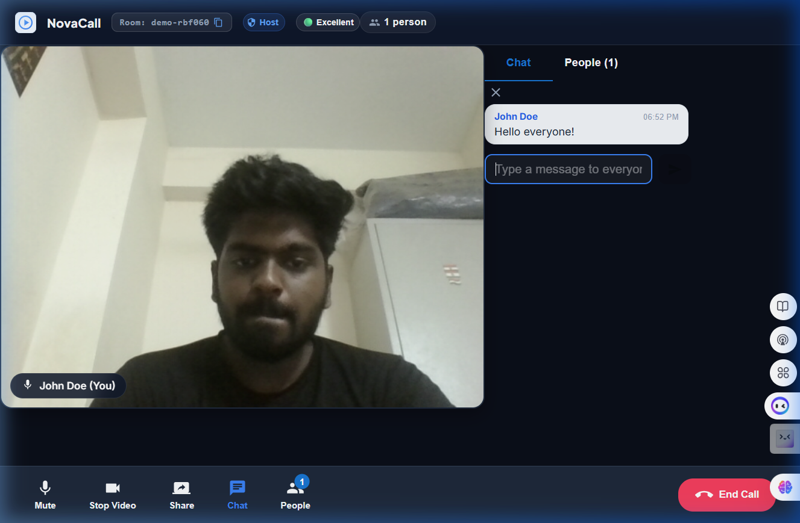
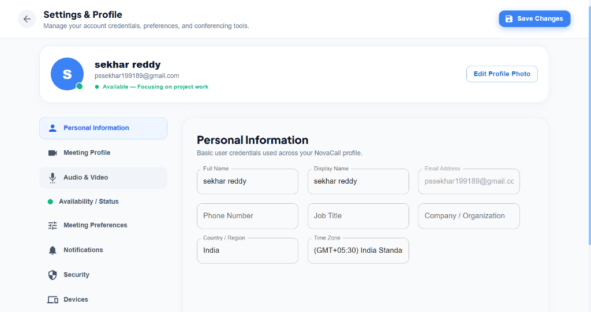
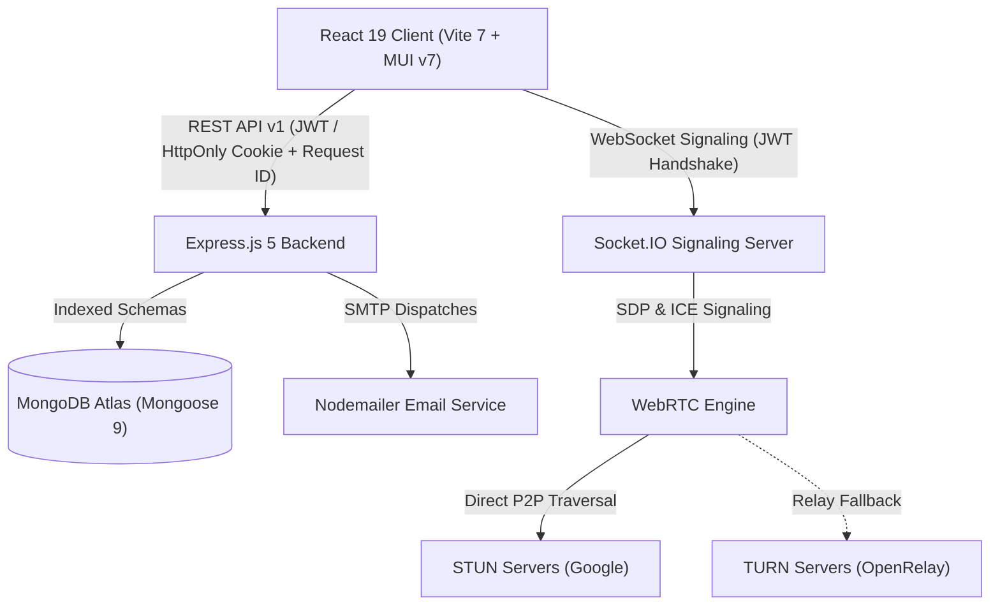
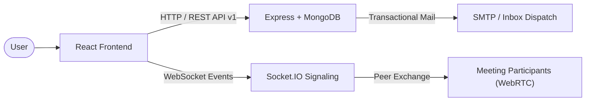
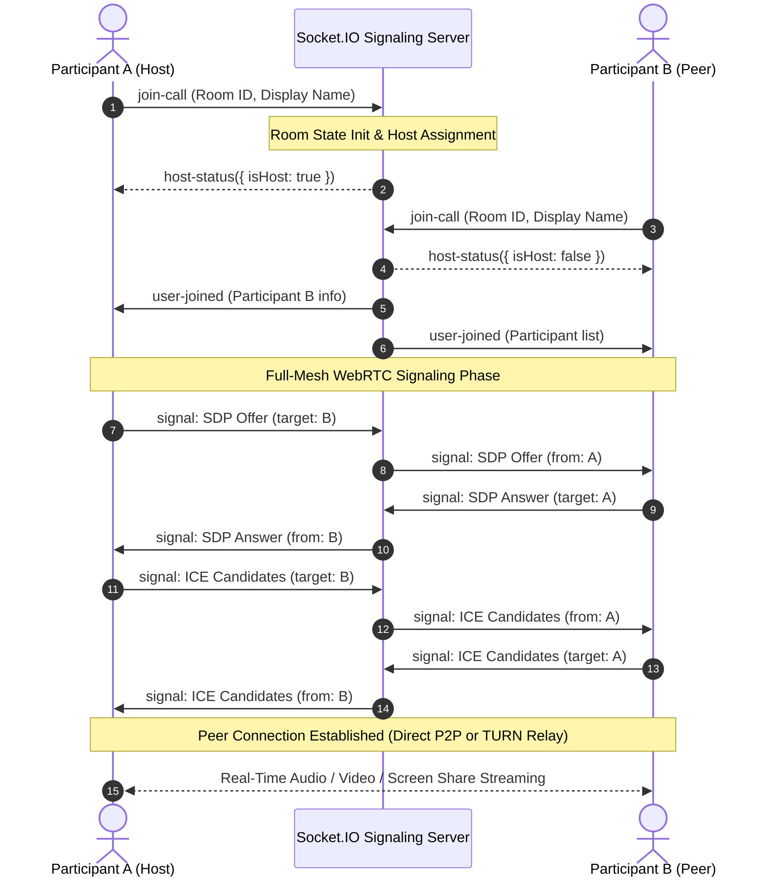

<div align="center">

# NovaCall

**Real-Time Multi-Party Video Conferencing & WebRTC Signaling Platform**

[](https://novacall-two.vercel.app/)
[](https://react.dev/)
[](https://nodejs.org/)
[](https://expressjs.com/)
[](https://socket.io/)
[](https://webrtc.org/)
[](https://www.mongodb.com/)
[](backend/src/services/email.service.js)
[](docker-compose.yml)
[](e2e/)
[](http://localhost:8000/api/docs)

<br />

[Live Demo](https://novacall-two.vercel.app/) • [API Documentation](http://localhost:8000/api/docs) • [Socket Protocol Spec](backend/docs/SOCKET_EVENTS.md) • [Report Issue](https://github.com/Sekhar01807/Novacall/issues)

<br />



</div>

---

## Overview

NovaCall is an open-source real-time video conferencing platform built without commercial third-party WebRTC wrappers. It integrates a custom full-mesh WebRTC engine with a modular Socket.IO signaling layer, adaptive STUN/TURN NAT traversal, server-authoritative room moderation, dual `HttpOnly` cookie and stateless JWT authentication with instant revocation (`tokenVersion`), atomic IDOR-protected REST APIs, transactional SMTP email dispatches (Nodemailer), and request correlation tracking (`X-Request-Id`).

The platform includes a containerized Docker Compose environment, comprehensive unit and security test suites, and end-to-end browser testing with Playwright.

---

## 📸 Visual Tour & Implemented Interface Showcase

Explore the live implemented user experience, core workflows, and interface architecture across the NovaCall platform.

### 1. Marketing Landing Page & Guest Access



- **Instant Guest Demo**: One-click demo call launch (`Try Instant Demo Call`) allowing instant testing without registration.
- **Direct Auth Gateway**: Direct navigation to Sign In and Sign Up portals with persistent session recognition.
- **Product Information & FAQ**: Detailed overview of browser compatibility, WebRTC media encryption standards, and platform capabilities.
- **Responsive Layout**: Full viewport optimization for mobile, tablet, and high-resolution desktop displays.

---

### 2. Sign In Portal & Zero-Trust Authentication


- **Credential Authentication**: Strict verification with bcrypt password validation.
- **Pure HttpOnly Cookies**: JWT tokens issued strictly in secure `HttpOnly`, `SameSite` cookies; never leaked in JSON bodies or `localStorage`.
- **Anti-Enumeration Generic Responses**: Prevents username/email discovery on failed attempts.
- **Guest Join Shortcut**: Quick bypass button allowing direct room entry without logging in.

---

### 3. User Registration & Onboarding


- **New Account Registration**: Full name, unique username/email, and password validation.
- **Automated Onboarding Dispatch**: Instant welcome email sent to user inbox via Nodemailer SMTP.
- **Password Strength Enforcement**: Minimum 8 characters, uppercase, and numeric validation.
- **Instant Session Establishment**: Immediate cookie-based login redirection to user dashboard.

---

### 4. Personal Dashboard & Instant Conference Hub



- **Instant Conference Creation**: One-click generation of dynamic 6-character room codes.
- **Direct Code Join**: Quick-entry input field to jump directly into active meetings.
- **Upcoming Meetings Widget**: Displays upcoming scheduled conferences with direct launch buttons.
- **Recent Activity Summary**: Shows recent call logs with instant rejoin shortcuts.

---

### 5. Schedule Meeting Modal & Calendar Invites


- **Meeting Details Configuration**: Custom room title, description/agenda, date, and start time.
- **Duration & Timezone Picker**: Flexible meeting length (15m, 30m, 45m, 60m+) and timezone selection (e.g. IST, UTC).
- **Guest Email Invitations**: Automatically delivers rich HTML calendar invite cards to invitees.
- **Shareable Meeting Link**: Generates instant copyable room links for team distribution.

---

### 6. Pre-Call Lobby & Device Readiness


- **Webcam & Mic Hardware Inspection**: Real-time camera feed preview to check framing, lighting, and microphone readiness before connecting.
- **Identity Customization**: Set a custom display name for guest sessions or automatically bind authenticated username.
- **Permission Diagnostics**: Visual feedback for camera and microphone browser permissions.
- **One-Click Stage Entry**: Seamless transition into the active WebRTC mesh signaling pipeline.

---

### 7. Live Multi-Party Meeting Stage & People Panel


- **Custom WebRTC Mesh Engine**: High-definition peer-to-peer audio and video streaming with automatic bandwidth adaptation.
- **Dual NAT Traversal**: Direct P2P connectivity via Google STUN with automatic OpenRelay TURN relay fallback.
- **Server-Authoritative Host Moderation**: First participant is designated Host with moderation privileges:
  - Remote microphone muting (`host-mute-user`)
  - Disruptive participant expulsion (`host-kick-user`)
  - Global meeting termination (`end-meeting-all`)
- **People Drawer**: Slide-out panel listing all connected participants with Host badges and individual audio/video statuses.
- **Connection Diagnostics Badge**: Real-time round-trip latency (RTT) and packet loss metrics (`Excellent`, `Good`, `Fair`, `Poor`).

---

### 8. Real-Time In-Meeting Chat Drawer



- **Sub-Second Message Delivery**: Dedicated Socket.IO room channels with client-side optimistic message rendering.
- **Sliding-Window Anti-Abuse Rate Limiter**: Maximum 5 messages per 3-second window per socket connection.
- **Dual-Layer XSS Protection**: Server-side HTML entity sanitization (`sanitizeHTML`), 1000-character cap, and contextual JSX encoding.
- **Chat History Synchronization**: Instant replay of in-call messages to participants upon entering the room.

---

### 9. Native Screen Sharing Pipeline


- **Native Browser API**: Utilizes `navigator.mediaDevices.getDisplayMedia` without requiring third-party plugins.
- **Flexible Source Selection**: Choose between Entire Screen, specific Application Window, or individual Chrome/Browser Tabs.
- **System Audio Sharing**: Optional toggle to broadcast tab/system audio alongside the video feed.
- **Dynamic Track Replacement**: Seamlessly switches RTCPeerConnection video tracks from webcam to display stream and auto-reverts on stop.

---

### 10. Meeting History Logs & Activity Auditing


- **Activity Audit Log**: Paginated records of all joined and hosted meeting sessions.
- **Session Metadata**: Formatted recording timestamps, room codes, and completion states.
- **Real-Time Search**: Filter history by room code with responsive pagination controls.
- **Quick Actions**: One-click "Copy Code" and "Rejoin Room" buttons.

---

### 11. User Profile & Security Settings



- **Profile Information**: Update full name, display name, job title, organization, and timezone.
- **Global Session Revocation**: Invalidate all active JWT sessions across devices via `tokenVersion` increment.
- **Password Management**: Secure credential update with automated cookie clearance.
- **Atomic Account Deletion**: Complete transactional purge of user data, history, and scheduled meetings.

---

## Core Capabilities

### Video Conferencing & Adaptive NAT Traversal
- **Custom WebRTC Mesh Engine**: Multi-party audio/video streaming with dynamic peer connection pooling, track lifecycle management, and bandwidth optimization.
- **Adaptive NAT Traversal**: Dual Google STUN servers for direct P2P connections with automatic OpenRelay TURN fallback for restrictive symmetric NATs and enterprise firewalls.
- **In-Call Controls**: Instant camera and microphone toggles, native screen sharing via `getDisplayMedia`, and dynamic responsive video grids.
- **Connection Health Diagnostics**: Real-time round-trip time (RTT) tracking, packet loss telemetry, and live visual connection badges (`Excellent`, `Good`, `Fair`, `Poor`).

### Server-Authoritative Room Moderation
- **Automatic Host Designation**: The initial participant entering a room is automatically assigned Host privileges.
- **Host Moderation Controls**: Remote participant microphone muting (`host-mute-user`), participant expulsion (`host-kick-user`), and global meeting termination (`end-meeting-all`).
- **Dynamic Host Succession**: Seamless promotion of the next longest-standing participant when the active host disconnects.
- **Mesh Capacity Enforcement**: Hard cap of 6 concurrent participants per room optimized for full-mesh P2P bandwidth.

### Real-Time Chat & Anti-Abuse
- **Low-Latency Message Delivery**: Broadcast via dedicated Socket.IO room channels with client-side optimistic UI updates.
- **Dual-Layer XSS Protection**: Server-side HTML entity sanitization (`sanitizeHTML`), 1000-character payload truncation, and contextual React JSX string encoding on the client.
- **Sliding-Window Rate Limiting**: Anti-flood protection (maximum 5 messages per 3-second window) per socket connection with automatic memory cleanup upon disconnection.
- **Chat History Synchronization**: Automatic synchronization of in-meeting chat history to newly joined participants.

### Transactional Email Dispatching & Modern Card Templates
- **Welcome Onboarding Email**: Automatically dispatched to newly registered users introducing platform capabilities with a direct link to the dashboard.
- **Scheduled Meeting Calendar Dispatches**: Rich HTML email card with dynamic calendar date tile, formatted date/time, timezone, room code badge, agenda, and direct one-click join link dispatched to both the host and invited guest email lists.
- **Cryptographic Password Reset**: Secure 6-digit verification code emails with single-use 15-minute TTL.
- **Modern Email Card System**: Built with cross-client bulletproof table markup, glowing header gradient accents (`#3B82F6` $\rightarrow$ `#EC4899`), midnight brand bar, monospace code pills, and responsive layout for Gmail, Apple Mail, Outlook, and mobile clients.

### Zero-Trust Authentication & IDOR Protection
- **Pure HttpOnly Cookie Session Architecture**: Issues secure `HttpOnly`, `SameSite`, `Secure` session cookies with zero JWT leakage in JSON response payloads, completely preventing token exfiltration via client-side scripts.
- **WebSocket Handshake Auth & URL Query Exclusion**: Socket.IO authenticates strictly via `HttpOnly` session cookies (`token`/`jwt`), `auth.token`, or `Authorization: Bearer` headers. URL query parameter tokens (`?token=...`) are explicitly disallowed to prevent credential exposure in access logs and proxies.
- **Full-Stack Session Revocation (`tokenVersion`)**: Atomic user `tokenVersion` increments immediately invalidate all active JWTs across both HTTP endpoints and WebSocket signaling handshakes upon password changes or global sign-out (`signOutAllDevices`).
- **Safe Profile DTO Protection**: Explicit public DTO whitelisting (`buildUserProfileDTO`), strictly preventing leakage of reset tokens, expiration timestamps, token versions, or credentials.
- **Cryptographic Password Reset**: Secure 6-digit verification codes stored exclusively as SHA-256 hashes with 15-minute TTL, 5-attempt rate limits, and constant-time generic responses preventing account enumeration.
- **Strict Multi-Tenant Resource Isolation**: Atomic queries prevent unauthorized access or deletion of third-party meetings, histories, or profile data.
- **Standardized API Responses**: Centralized response formatting with structured error codes, correlation IDs (`X-Request-Id`, `X-Correlation-Id`), and API versioning (`X-API-Version`).

---

## Tech Stack

| Layer | Technologies | Purpose |
| :--- | :--- | :--- |
| **Frontend** | React 19, Vite 7, Material UI (MUI v7), Axios, WebRTC API | Single-Page Application (SPA), Design System & Real-Time Media Pipeline |
| **Backend** | Node.js 22 LTS, Express.js 5, Socket.IO 4.8 | RESTful API & Real-Time WebSocket Signaling Server |
| **Database** | MongoDB Atlas, Mongoose 9 | Multi-tenant schema storage with compound indexes |
| **Email Service** | Nodemailer, SMTP (Gmail / Brevo / Custom) | Transactional email dispatches (welcome, meeting invites, password resets) |
| **Security** | jsonwebtoken, cookie-parser, bcrypt, crypto (SHA-256), Hardened CSP, CSRF middleware | Zero-trust auth, HttpOnly cookies, session revocation & sliding rate limiting |
| **Infrastructure** | Docker, Docker Compose, Nginx, Vercel, Render | Containerized multi-service orchestration and cloud edge hosting |
| **Testing** | Node.js Test Runner (`node:test`), Playwright E2E | Unit, security, socket lifecycle, email fallback, and E2E browser test suites |

---

## System Architecture



> [!NOTE]
> For detailed Socket.IO event specifications, payload schemas, rate limit rules, and sequence diagrams, refer to the [Socket.IO Events Documentation](backend/docs/SOCKET_EVENTS.md).

### Communication Flow



---

## WebRTC Signaling & Connection Sequence

NovaCall coordinates direct peer-to-peer media streaming using an interactive ICE exchange pipeline:



---

## Project Structure

```
Novacall/
├── .github/
│   └── workflows/
│       └── ci.yml                 # Node 22 CI pipeline (npm ci, tests, build)
├── backend/
│   ├── docs/
│   │   └── SOCKET_EVENTS.md      # Socket.IO protocol specification & sequence flows
│   ├── src/
│   │   ├── controllers/          # REST route controllers
│   │   │   ├── user.controller.js          # Auth (login, register + welcome email dispatch)
│   │   │   ├── profile.controller.js       # Profile CRUD, cookie clearance & session revocation
│   │   │   ├── passwordReset.controller.js # SHA-256 token generation & reset code dispatch
│   │   │   ├── meetingHistory.controller.js# Activity pagination, schedule CRUD & invite dispatches
│   │   │   └── socketManager.js            # Socket initialization wrapper
│   │   ├── docs/                 # OpenAPI 3.0 specification & Swagger UI (swaggerSpec.js)
│   │   ├── middleware/           # auth.middleware.js, error.middleware.js, requestId.middleware.js, csrf.middleware.js
│   │   ├── models/               # UserModel.js, meetingModel.js, scheduledMeetingModel.js
│   │   ├── routes/               # UsersRoutes.js
│   │   ├── services/             # email.service.js (Nodemailer SMTP & card templates)
│   │   ├── sockets/              # Modular Socket.IO architecture
│   │   │   ├── handlers/         # room, signaling, chat, media, moderation handlers
│   │   │   ├── middleware/       # Handshake JWT authentication & validator
│   │   │   ├── roomState.js      # In-memory room and message store
│   │   │   └── index.js          # Socket server initialization & routing
│   │   ├── utils/                # apiError.js, errorCodes.js, jwt.js, logger.js, roomCodeGenerator.js, validators.js, allowedOrigins.js
│   │   └── app.js                # Express app, CSP, cookieParser, rate limiting, CORS & health check
│   ├── tests/
│   │   ├── auth.test.js          # Auth, cookies, email service fallback & revocation tests
│   │   ├── meetings.test.js      # Scheduled meetings & IDOR tests
│   │   ├── socket.test.js        # Socket lifecycle, room capacity & moderation tests
│   │   ├── chat.test.js          # Rate limiting, XSS sanitization & room isolation tests
│   │   ├── webrtc.test.js        # WebRTC signaling boundary isolation tests
│   │   └── errorMiddleware.test.js# Centralized error handler & API exception tests
│   ├── Dockerfile                # Multi-stage Alpine container
│   ├── package.json
│   └── .env.example
├── frontend/
│   ├── src/
│   │   ├── assets/               # images.js (SVG & brand asset loaders)
│   │   ├── contexts/             # AuthContext.jsx (withCredentials: true)
│   │   ├── pages/                # Landing, Auth, Home, History, Profile, VideoMeet, NotFound
│   │   │   ├── landingPage.jsx   # Marketing landing page with FAQ & navigation
│   │   │   ├── authentication.jsx# Auth portal (Sign In, Sign Up, Forgot Password, Reset Code)
│   │   │   ├── home.jsx          # Dashboard with duration, timezone & guest invite scheduling
│   │   │   ├── history.jsx       # Meeting activity history with search & pagination
│   │   │   ├── profile.jsx       # User profile, theme settings & password management
│   │   │   ├── notFound.jsx      # 404 error page
│   │   │   └── videoMeet/        # Meeting orchestrator and components
│   │   │       ├── components/   # VideoGrid, VideoTile, ChatPanel, ParticipantList, LobbyView, MeetingHeader, MeetingControls, MeetingModals, ConnectionQualityIndicator
│   │   │       ├── hooks/        # useWebRTCConnection.js, useMediaDevices.js
│   │   │       ├── services/     # socketService.js
│   │   │       └── VideoMeet.jsx # Meeting view orchestrator
│   │   ├── styles/               # CSS modules & styling (videoComponent.module.css)
│   │   ├── utils/                # textUtils.js, withAuth.jsx
│   │   ├── App.jsx               # Application routing & providers
│   │   ├── App.css               # Global application styling
│   │   ├── environment.js        # Dynamic environment URL resolver
│   │   ├── index.css             # Design tokens & CSS variables
│   │   └── index.jsx
│   ├── public/                   # Static assets & screenshot captures
│   ├── Dockerfile                # Multi-stage Node 22 + Nginx SPA container
│   ├── nginx.conf                # Nginx SPA rewrite routing
│   ├── package.json
│   └── vite.config.js
├── e2e/
│   ├── flagship-flow.spec.js     # Full journey: Register → Login → Meet → Moderate → Leave
│   ├── auth.spec.js              # Authentication & onboarding tests
│   ├── lobby.spec.js             # Device readiness & lobby preview tests
│   ├── meeting.spec.js           # In-meeting controls and chat drawer tests
│   ├── webrtc-mesh.spec.js       # Multi-browser WebRTC peer discovery tests
│   ├── history.spec.js           # Meeting history & pagination tests
│   └── navigation.spec.js        # Route navigation & theme tests
├── screenshots/                  # Application interface captures
├── docker-compose.yml            # Multi-service stack (Frontend + Backend + MongoDB)
├── playwright.config.js          # Playwright E2E configuration
└── README.md                     # Project documentation
```

---

## Security Architecture & Authorization Invariants

NovaCall implements defense-in-depth security across HTTP REST and WebSocket signaling layers:

### 1. Pure HttpOnly Cookie Session Architecture & Strict CORS
- **Pure HttpOnly Cookie Protection**: Login and registration issue secure `HttpOnly`, `SameSite=Lax/None`, `Secure` session cookies with 7-day expiration. The JWT access token is **never exposed in JSON response bodies** and **never stored in `localStorage`**, eliminating credential exfiltration risks from Cross-Site Scripting (XSS).
- **Strict Origin Whitelisting**: CORS explicitly permits only configured and trusted origins (`https://novacall-two.vercel.app`, local dev servers). Wildcard `.vercel.app` allowances are strictly eliminated.
- **Origin & CSRF Defense**: State-changing endpoints (`POST`, `PUT`, `PATCH`, `DELETE`) are protected by `csrfProtectionMiddleware`, enforcing strict `Origin` and `Referer` validation against the trusted origin whitelist.
- **Session Cleanup**: `logout`, `signOutAllDevices`, `changePassword`, and `deleteAccount` explicitly clear session cookies (`res.clearCookie('token')`) and increment the user's `tokenVersion`.

### 2. Invariable IDOR (Insecure Direct Object Reference) Protection
- **Scheduled Meetings**: Creation, retrieval, and deletion queries are strictly scoped to `req.user.username`. `DELETE /delete_scheduled_meeting/:id` executes an atomic `findOneAndDelete({ _id: id, user_id: req.user.username })` query. If the target resource belongs to another account, the server rejects the operation with `403 FORBIDDEN` (differentiated from `404 NOT_FOUND`).
- **Meeting Activity History**: History records and paginated query results are strictly bound to the authenticated `req.user.username`.
- **User Profile DTO Protection**: `GET /get_profile` and `POST /update_profile` return an explicit public DTO (`buildUserProfileDTO`), strictly preventing leakage of `resetPasswordToken`, `resetPasswordExpires`, `resetPasswordAttempts`, `tokenVersion`, or credentials.
- **Atomic Account Deletion**: Executes within a MongoDB transaction session to ensure clean cascading deletion of user history, scheduled meetings, and credentials.
- **Anti-Enumeration Generic Responses**: Generic responses on `/login` (`AUTH_INVALID_CREDENTIALS`) and `/forgot_password` ensure malicious actors cannot enumerate registered usernames or emails.

### 3. Five-Stage Socket.IO Event Authorization Pipeline
Every real-time event passes through an authoritative 5-stage validation pipeline:

```
Handshake Authentication ──▶ Room Membership ──▶ Payload Validation ──▶ Authorization ──▶ State Transition
```

1. **Authentication**: Handshake JWT verification via `HttpOnly` session cookie (`token`/`jwt`), `auth.token`, or `Authorization: Bearer` header attaches verified user identity (`socket.user`) and strictly enforces database `tokenVersion` validity (`AUTH_SESSION_REVOKED`). Handshake URL query parameter tokens are explicitly rejected to prevent credential leakage in proxy/access logs. Client-supplied display names cannot spoof authenticated accounts.
2. **Room Membership**: Sockets must be active participants in the target room. Cross-room signaling and chat emissions are rejected.
3. **Payload Validation**: Input sizes, strings, and types are validated; signaling messages are capped at 64KB; chat messages are capped at 1000 characters.
4. **Authorization**: Host-exclusive actions (`host-mute-user`, `host-kick-user`, `end-meeting-all`) are verified server-side via `room.hostSocketId === socket.id`.
5. **State Transition**: State updates (media muting, participant eviction, room destruction) update `roomState` and notify room peers. Rate-limit tracking maps are automatically purged upon socket disconnect.

### 4. Password-Reset Production Boundary & Durable Rate Limiting
- **Cryptographic Token Hashing**: Verification codes are generated via `crypto.randomInt(100000, 1000000)` and stored exclusively as a **SHA-256 hash** (`crypto.createHash("sha256")`).
- **Durable Attempt Persistence**: Invalid verification attempts are immediately persisted to MongoDB (`user.resetPasswordAttempts`), ensuring the strict **max 5 failed attempts** rate limit cannot be reset by server process restarts.
- **TTL & Invalidation**: Reset codes expire strictly after **15 minutes**. When 5 attempts are exceeded or a password reset succeeds, tokens are permanently deleted from database and memory.
- **Nodemailer Dispatch**: In production mode with configured SMTP credentials, reset codes are delivered out-of-band to the user's verified inbox; in local development without SMTP, the code is previewed in logs for automated test runners.

---

## REST API Reference

| Endpoint | Method | Auth Required | Description |
| :--- | :---: | :---: | :--- |
| **Authentication & Password Recovery** | | | |
| `/api/v1/users/register` | `POST` | No | Register new user account; sets HttpOnly cookie; sends Welcome Email |
| `/api/v1/users/login` | `POST` | No | Authenticate credentials; sets secure HttpOnly session cookie |
| `/api/v1/users/logout` | `POST` | No | Clear active HttpOnly session cookie |
| `/api/v1/users/forgot_password` | `POST` | No | Request 6-digit SHA-256 reset verification code; dispatches email card |
| `/api/v1/users/reset_password` | `POST` | No | Verify reset code and update user password |
| **User Profile & Security** | | | |
| `/api/v1/users/get_profile` | `GET` | Yes | Retrieve authenticated user profile (safe DTO) |
| `/api/v1/users/update_profile` | `POST` | Yes | Update user preferences, status, and theme settings |
| `/api/v1/users/change_password` | `POST` | Yes | Change user password, clear cookies, and invalidate sessions |
| `/api/v1/users/signout_all` | `POST` | Yes | Clear cookies and invalidate all active JWTs by incrementing `tokenVersion` |
| `/api/v1/users/delete_account` | `POST` | Yes | Permanently delete account and all associated meetings/history |
| **Meeting Management & History** | | | |
| `/api/v1/users/add_to_activity` | `POST` | Yes | Record a joined meeting code into user's activity log |
| `/api/v1/users/get_all_activity` | `GET` | Yes | Paginated meeting history with optional search query |
| `/api/v1/users/create_scheduled_meeting` | `POST` | Yes | Schedule conference; dispatches calendar emails to host & invitees |
| `/api/v1/users/get_upcoming_meetings` | `GET` | Yes | Fetch all scheduled meetings for the authenticated user |
| `/api/v1/users/delete_scheduled_meeting/:id` | `DELETE` | Yes | Atomic IDOR-protected cancellation of a scheduled meeting |
| **System & Monitoring** | | | |
| `/health` | `GET` | No | System health check (database connection status, API version, uptime, timestamp) |
| `/api/docs` | `GET` | No | Interactive Swagger UI API explorer |
| `/api/openapi.json` | `GET` | No | OpenAPI 3.0 JSON specification |

---

## Automated Testing

NovaCall maintains a complete automated test matrix covering unit, security, socket lifecycle, email fallback, and end-to-end browser flows:

```bash
# Run all backend unit, security, socket, and email tests
npm run test:backend

# Run complete Playwright end-to-end test suite
npm run test:e2e

# Run Playwright E2E tests with interactive UI mode
npm run test:e2e:ui
```

### Backend Test Matrix (`backend/tests/`)
- **Authentication & Security (`auth.test.js`)**: Registration, duplicate rejection, login verification, expired JWT handling, tampered JWT detection, password reset SHA-256 hashing, rate limiting, `tokenVersion` revocation, safe profile DTO verification, anti-enumeration generic responses, and **Nodemailer email service fallback tests (welcome, reset, schedule)**.
- **Meetings & IDOR Invariants (`meetings.test.js`)**: Room code generation, scheduled meeting creation (`scheduled_date`, `scheduled_time`, `duration`, `time_zone`), pagination, atomic deletion, IDOR isolation across history, profile updates, and credential changes.
- **Socket.IO Lifecycle (`socket.test.js`)**: JWT handshake authentication, identity spoofing prevention, room join/leave lifecycle, host assignment, host succession upon disconnect, host mute/kick/end-meeting authorization, mesh capacity (6 users), and rate-limit map cleanup on disconnect.
- **Chat Anti-Abuse (`chat.test.js`)**: Sliding-window rate limiting (5 msg / 3s), XSS sanitization, 1000-character payload limits, and cross-room isolation.
- **WebRTC Signaling Boundary (`webrtc.test.js`)**: Intra-room SDP/ICE candidate relaying and cross-room signaling rejection.
- **Centralized Error & Global Middleware (`errorMiddleware.test.js`)**: Custom ApiError handling, async exception bubbling, 404 route handling, and standard error code payload formatting.

### Playwright E2E Test Suite (`e2e/`)
- **Flagship Flow (`flagship-flow.spec.js`)**: End-to-end user journey: Register → Login → Create Room → Join Stage → Moderate Participants → Toggle Controls → Send Chat → Leave Cleanly.
- **Authentication Flow (`auth.spec.js`)**: User registration, login verification, validation states, and auth redirection.
- **Lobby & Pre-Call Preview (`lobby.spec.js`)**: Camera/mic device readiness, permission checks, and stage initialization.
- **In-Meeting Controls (`meeting.spec.js`)**: Device state toggling, participant drawer, chat interface, and exit confirmation dialogs.
- **WebRTC Mesh Discovery (`webrtc-mesh.spec.js`)**: Multi-browser peer discovery, stream attachment, and media state propagation.
- **Meeting History (`history.spec.js`)**: Activity log persistence, search filtering, and pagination.
- **Navigation & Layout (`navigation.spec.js`)**: Route navigation, guest access rules, and responsive interface layout.

---

## Getting Started

### Option 1: Docker Compose (Recommended)

Spin up the entire stack (Frontend, Backend, and MongoDB) with a single command:

```bash
docker compose up --build
```

- **Frontend SPA**: `http://localhost:3000`
- **Backend API**: `http://localhost:8000`
- **Interactive Swagger Docs**: `http://localhost:8000/api/docs`
- **Health Check Endpoint**: `http://localhost:8000/health`

---

### Option 2: Local Manual Setup

#### 1. Clone Repository
```bash
git clone https://github.com/Sekhar01807/Novacall.git
cd Novacall
```

#### 2. Backend Setup
```bash
cd backend
npm install
```

Create a `.env` file in the `backend/` directory:
```env
PORT=8000
ATLASDB_URL=your_mongodb_connection_string
JWT_SECRET=your_secure_jwt_secret
FRONTEND_URL=http://localhost:5173

# Optional: Gmail / SMTP Email Dispatch Configuration
SMTP_SERVICE=gmail
SMTP_USER=your_email@gmail.com
SMTP_PASS=your_16_character_app_password
EMAIL_FROM="NovaCall Security" <your_email@gmail.com>
```

Start the backend service:
```bash
npm run dev
```

#### 3. Frontend Setup
In a new terminal window:
```bash
cd frontend
npm install
```

Create a `.env` file in the `frontend/` directory:
```env
VITE_API_URL=http://localhost:8000
```

Start the frontend development server:
```bash
npm run dev
```

The application will be accessible at `http://localhost:5173`.

---

## API Documentation & Monitoring

NovaCall includes interactive Swagger UI documentation and health monitoring:

- **Interactive API Explorer**: [`http://localhost:8000/api/docs`](http://localhost:8000/api/docs)
- **OpenAPI 3.0 Specification**: [`http://localhost:8000/api/openapi.json`](http://localhost:8000/api/openapi.json)

### Health Check Endpoint

**`GET /health`**
```json
{
  "status": "ok",
  "version": "1.0.0",
  "uptime": 342,
  "database": "connected",
  "requestId": "req_f829a4c17b",
  "timestamp": "2026-08-29T12:00:00.000Z"
}
```

---

## Environment Variables

### Backend Configuration (`backend/.env`)

| Variable | Required | Default | Description |
| :--- | :---: | :---: | :--- |
| `PORT` | No | `8000` | HTTP and WebSocket server port |
| `ATLASDB_URL` | Yes | — | MongoDB Atlas connection string |
| `JWT_SECRET` | Yes | — | Secret key for HMAC-SHA256 JWT signing and verification |
| `FRONTEND_URL` | No | `http://localhost:5173` | Allowed CORS origins (comma-separated for multiple origins) |
| `MAX_ROOM_CAPACITY` | No | `6` | Maximum concurrent participants allowed per meeting room |
| `NODE_ENV` | No | `development` | Runtime environment (`development`, `production`, `test`) |
| `SMTP_SERVICE` | No | `gmail` | Preconfigured email service provider (e.g. `gmail`) |
| `SMTP_HOST` | No | `smtp.gmail.com` | Custom SMTP email server host |
| `SMTP_PORT` | No | `587` | SMTP server port (`587` for STARTTLS, `465` for SSL/TLS) |
| `SMTP_USER` | No | — | SMTP username / sender email address |
| `SMTP_PASS` | No | — | SMTP app password or secret key |
| `EMAIL_FROM` | No | `"NovaCall Security" <...>` | Sender display name and email address header |

### Frontend Configuration (`frontend/.env`)

| Variable | Required | Default | Description |
| :--- | :---: | :---: | :--- |
| `VITE_API_URL` | Yes | `http://localhost:8000` | Base URL for backend REST API and WebSocket connection |
| `VITE_TURN_URL` | No | — | Optional custom TURN relay server URL |
| `VITE_TURN_USERNAME` | No | — | Optional TURN server authentication username |
| `VITE_TURN_CREDENTIAL` | No | — | Optional TURN server authentication password/credential |

---

## Architecture Trade-offs & Deployment Scope

1. **Full-Mesh P2P Topology (6-Participant Capacity)**: Video and audio streams are exchanged directly peer-to-peer ($N-1$ streams per participant). The server enforces a hard limit of 6 participants per room to preserve client bandwidth and CPU usage. For larger rooms (20+ participants), transitioning to a Selective Forwarding Unit (SFU) architecture is recommended.
2. **Single-Instance In-Memory State**: Active meeting rooms, participant presence, and sliding-window rate limit counters are maintained in Node process memory for ultra-low latency signaling without database overhead. This single-node model is optimized for single-instance container deployments. For clustered horizontal scaling, state must be migrated to a shared Redis cluster (`@socket.io/redis-adapter` and Redis hash stores).
3. **Dual Authentication Boundary (HttpOnly Cookies + Bearer Tokens)**: The backend sets secure `HttpOnly` session cookies on authentication to mitigate XSS vector token theft while retaining Bearer header compatibility for decoupled cross-origin frontend hosting (e.g. Vercel + Render).
4. **Email Dispatching**: Password reset verification codes, welcome onboarding cards, and meeting invitations are dispatched via Nodemailer SMTP in production, with automatic development logger fallback during local testing.

---

## Roadmap

### Implemented & Verified
- [x] Full-mesh WebRTC P2P audio and video conferencing pipeline
- [x] Adaptive NAT traversal (dual Google STUN + OpenRelay TURN fallback)
- [x] Native screen sharing via `getDisplayMedia`
- [x] Real-time in-meeting chat with sliding-window rate limiting & XSS sanitization
- [x] Server-authoritative host moderation (`host-mute-user`, `host-kick-user`, `end-meeting-all`)
- [x] Dynamic host succession upon host disconnection
- [x] Pre-call device lobby with camera/microphone readiness inspection
- [x] Meeting scheduler with date, time, duration, timezone & SMTP calendar email dispatches
- [x] User activity history with paginated logs, search filtering, and one-click rejoin
- [x] Pure `HttpOnly` cookie session authentication & instant `tokenVersion` revocation
- [x] Cryptographic SHA-256 password recovery with 6-digit codes and Nodemailer dispatches
- [x] Atomic IDOR protection across scheduled meetings, history logs, and user profile data
- [x] Playwright E2E and Node test runner automated test suites

### Upcoming Features
- [ ] In-meeting interactive live polls & real-time voting progress
- [ ] In-meeting shared collaborative notes with text export (`.txt`, `.pdf`)
- [ ] Raise hand to speak queue & live animated emoji reactions
- [ ] SFU Media Gateway integration (mediasoup / Pion) for high-capacity rooms (20+ participants)
- [ ] Distributed Redis Pub/Sub adapter (`@socket.io/redis-adapter`) for multi-instance horizontal scaling

---

## Author

**Sekhar Reddy**
- GitHub: [@Sekhar01807](https://github.com/Sekhar01807)
- LinkedIn: [Sekhar Reddy](https://www.linkedin.com/in/sekhar-reddy-408560281)
