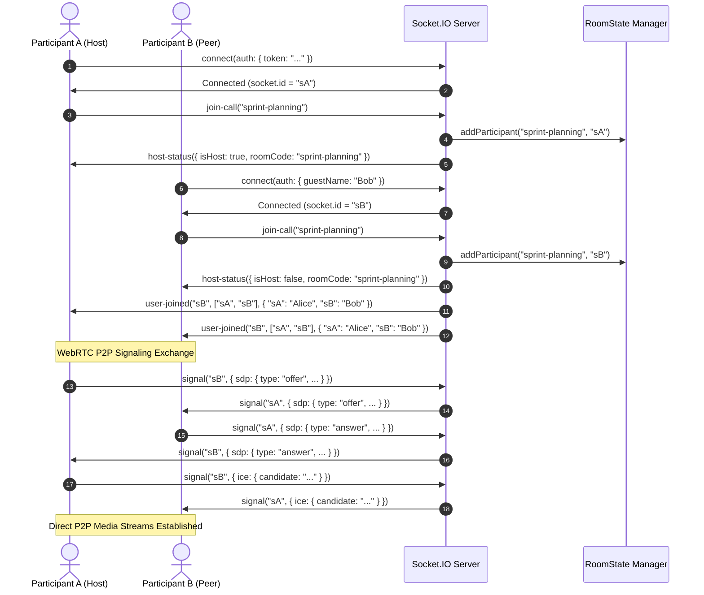
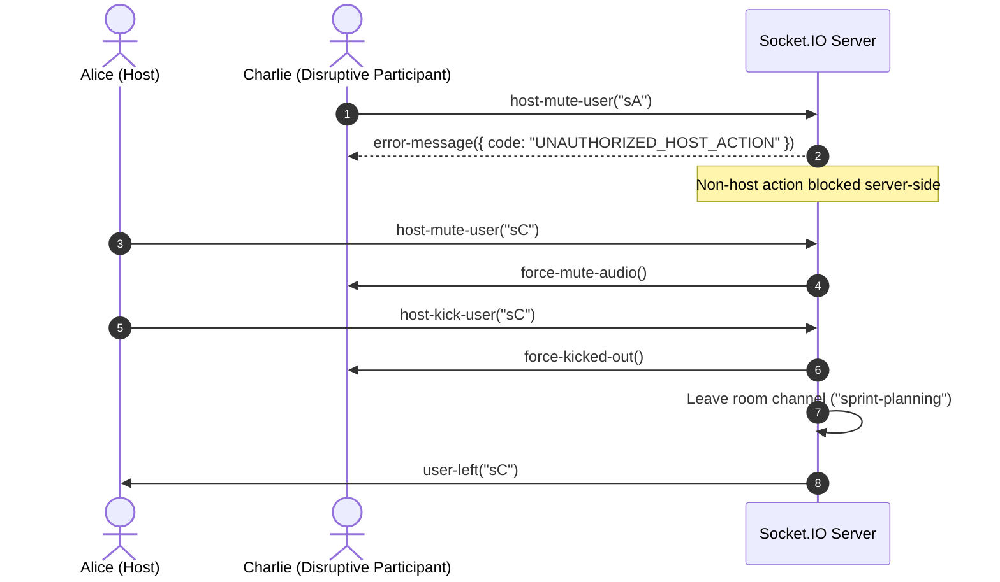
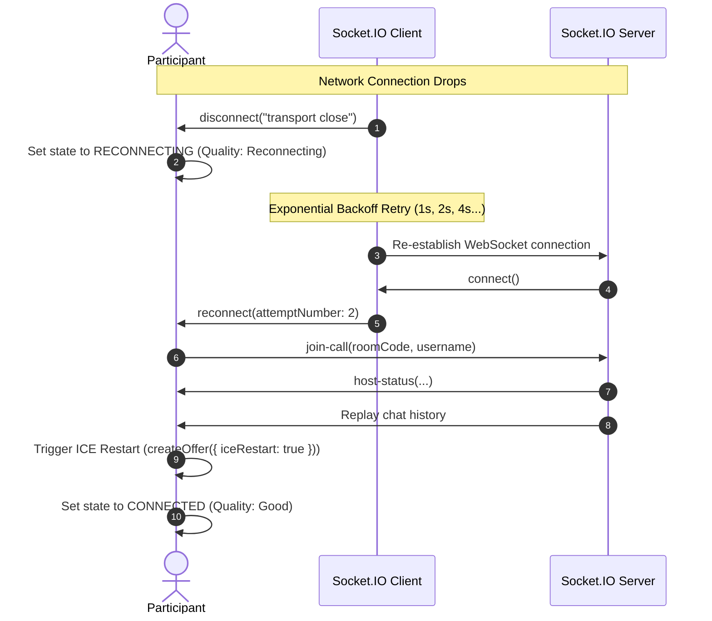

# NovaCall Socket.IO Event Specification & Protocol Guide

This document defines the real-time WebSocket protocol and event lifecycle implemented in the NovaCall real-time video conferencing engine.

---

## 1. Connection & Handshake

Socket.IO connections are authenticated at the handshake level via `socketAuthMiddleware`.

### Handshake Authentication Channels
Tokens may be supplied via:
1. **`auth` object**: `{ auth: { token: "<jwt>" } }`
2. **`HttpOnly` session cookie**: Sent automatically during HTTP handshake (`token` or `jwt` cookie)
3. **`Authorization` header**: `Authorization: Bearer <jwt>`

> [!IMPORTANT]
> **Query Parameter Rejection**: Passing tokens in handshake URL query parameters (`?token=<jwt>`) is **strictly disallowed** to prevent credential leakage in reverse proxy logs, browser histories, and server access logs.

### Handshake Authentication Payload
```json
{
  "auth": {
    "token": "eyJhbGciOiJIUzI1NiIsInR5cCI6IkpXVCJ9...",
    "guestName": "Guest Alex"
  }
}
```

* **Authenticated Users**: Providing a valid JWT token attaches the user's verified identity (`id`, `username`, `name`, `email`, `tokenVersion`) to `socket.user`. The client *cannot* spoof their display name.
* **Instant Session Revocation (`tokenVersion`)**: The handshake middleware actively verifies `tokenVersion` against the persistent user record. Tokens with outdated versions (revoked via global sign-out or password change) are rejected with `AUTH_SESSION_REVOKED`.
* **Guest Fallback**: If no token is provided, the user is assigned a guest session with a sanitized display name (`Guest Alex` or `guest_<socketId>`).
* **Connection Rejection**: Tampered or expired JWT tokens reject the connection with `AUTH_INVALID_TOKEN`. Revoked sessions reject with `AUTH_SESSION_REVOKED`. User accounts that no longer exist reject with `AUTH_USER_NOT_FOUND`.

---

## 2. Client-to-Server Events (Inbound)

| Event Name | Payload / Arguments | Description | Server Validation / Rate Limits |
|---|---|---|---|
| `join-call` | `(roomCodeOrUrl: string, clientDisplayName?: string)` | Join a video conference room by code or URL. | Room code sanitized; rate-limited (max 5/10s); enforces `ROOM_CAPACITY_EXCEEDED` if room >= 6 participants (optimal full-mesh limit). |
| `leave-call` | *None* | Explicitly leave the current meeting room. | Triggers participant teardown and host succession. |
| `signal` | `(toSocketId: string, message: string)` | Transmit WebRTC SDP Offer/Answer or ICE Candidate to a specific peer. | Rate-limited (max 30/3s); payload cap 64KB; enforces strict room isolation; cross-room signals are dropped. |
| `chat-message` | `(data: string, untrustedSender?: string)` | Send a text message to all participants in the active room. | Rate-limited: max **5 messages per 3 seconds**. Sanitizes HTML against XSS. Max length: 1,000 characters. |
| `toggle-media-state` | `(mediaType: 'audio' \| 'video', isEnabled: boolean)` | Broadcast local microphone/camera mute status. | Payload validated; updates server-side participant state and notifies room peers. |
| `host-mute-user` | `(targetSocketId: string)` | Mute the microphone of a specific participant in the room. | **Host Only**: Server validates `requireRoomHost(socket)`. Rate-limited (max 10/5s). Rejects non-host with `UNAUTHORIZED_HOST_ACTION`. |
| `host-kick-user` | `(targetSocketId: string)` | Remove/kick a participant from the meeting room. | **Host Only**: Server validates `requireRoomHost(socket)`; target cannot be self. |
| `end-meeting-all` | *None* | Terminate the meeting for all participants and purge room state. | **Host Only**: Server validates `requireRoomHost(socket)`; disconnects all peer room channels and deletes room. |

---

## 3. Server-to-Client Events (Outbound)

| Event Name | Payload Structure | Description |
|---|---|---|
| `host-status` | `{ isHost: boolean, roomCode: string, userId?: string }` | Emitted to a client upon joining to declare whether they hold Host privileges. |
| `user-joined` | `(joinedSocketId: string, participantSocketIds: string[], roomNamesMap: Record<string, string>)` | Broadcast to all room members when a new participant joins with updated peer lists and names. |
| `user-left` | `(leftSocketId: string)` | Broadcast to remaining room members when a participant disconnects or leaves. |
| `signal` | `(fromSocketId: string, message: string)` | Routed WebRTC SDP offer/answer or ICE candidate from a peer in the same room. |
| `chat-message` | `(data: string, sender: string, socketIdSender: string, timestamp: string)` | Broadcast chat message with authoritative server-enforced sender identity. |
| `user-media-state-changed` | `(socketId: string, mediaType: 'audio' \| 'video', isEnabled: boolean)` | Notifies peers when a participant toggles their microphone or camera. |
| `force-mute-audio` | *None* | Targeted event emitted to a participant when the Host forces their microphone muted. |
| `force-kicked-out` | *None* | Targeted event emitted to a participant when the Host removes them from the meeting. |
| `meeting-ended-by-host` | *None* | Broadcast to all participants when the Host terminates the session. |
| `error-message` | `{ code: string, message: string, [key: string]: any }` | Structured error event dispatched on operation failure or security rejection. |

---

## 4. Structured Error Codes Reference

| Error Code | Description | HTTP / Socket Trigger |
|---|---|---|
| `VALIDATION_ERROR` | Missing or invalid request parameters | Auth / Scheduling / History endpoints |
| `INVALID_PAYLOAD` | Malformed socket event payload or invalid types | Socket event validator |
| `AUTH_TOKEN_REQUIRED` | Missing Authorization Bearer token header | Protected REST endpoints |
| `AUTH_TOKEN_INVALID` | Invalid, tampered, or expired JWT | Auth middleware / Socket handshake |
| `AUTH_SESSION_REVOKED` | Session revoked via `tokenVersion` increment | Auth middleware / Socket handshake |
| `AUTH_USER_NOT_FOUND` | User account does not exist | Login / User profile fetch / Socket handshake |
| `AUTH_INVALID_CREDENTIALS` | Incorrect username or password | Login / Change password |
| `INVALID_ROOM_CODE` | Empty or malformed room code string | `join-call` |
| `ROOM_CAPACITY_EXCEEDED` | Meeting room has reached maximum limit (6) | `join-call` |
| `ROOM_JOIN_FAILED` | Internal error joining room | `join-call` |
| `RATE_LIMIT_EXCEEDED` | Request or message frequency threshold exceeded | REST rate limiter / `chat-message` / `signal` |
| `TOO_MANY_ATTEMPTS` | Exceeded 5 failed verification attempts | `reset_password` |
| `NOT_IN_ROOM` | Socket attempted in-meeting action without active room | `chat-message` / `signal` |
| `UNAUTHORIZED_HOST_ACTION` | Non-host attempted host moderation command | `host-mute-user`, `host-kick-user`, `end-meeting-all` |
| `NOT_FOUND` | Scheduled meeting or resource not found | REST delete endpoints |
| `FORBIDDEN` | Caller is not owner of target resource | Scheduled meeting cancellation |
| `INTERNAL_SERVER_ERROR` | Unhandled server exception | Global error handler |

---

## 5. Protocol Sequence Diagrams

### 5.1 Participant Join & Full-Mesh WebRTC Signaling



### 5.2 Host Moderation & Access Control



### 5.3 Network Interruption & Automatic Rejoin


